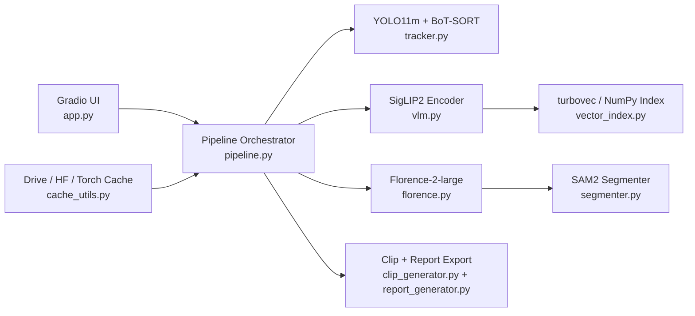
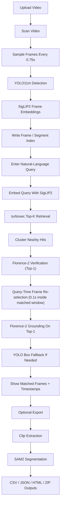

# VisionGuard AI Project Documentation

## 1. Project Summary

VisionGuard AI is a scan-first CCTV video search system.

The goal is:

- scan a CCTV or general surveillance-style video
- index the video once
- ask a natural-language query after scanning
- return the most relevant timestamps, frames, and clip windows
- show the matched frames immediately
- localize the queried object or region in matched clips
- generate exportable clips and reports

This is not a training pipeline. It is an inference pipeline.

The project does not fine-tune models when a video is uploaded.

## 2. Problem Statement

A person cannot manually watch long CCTV footage every time they need to find:

- a person sitting
- a white car entering
- a fight
- a fall
- a possible collision
- a crowd
- loitering

So the project converts a raw video into a searchable indexed representation, then uses vision-language retrieval and grounding to find likely matching parts.

## 3. Current High-Level Flow

The current app flow is:

1. Upload or choose a video.
2. Click `step 1: scan video`.
3. The system samples the video, tracks objects, and builds retrieval embeddings.
4. After scan completes, enter a natural-language query.
5. Click `step 2: find matches`.
6. The system searches indexed sampled frames, clusters them into clip candidates, verifies the top candidates, and returns top time ranges.
7. The UI shows the matched-frame gallery and timestamp table immediately.
8. After search, the top-1 matched frame is shown with grounding boxes drawn if Florence-2 phrase grounding succeeds. For detector-supported classes, YOLO scan-time boxes are used as fallback.
9. No clip is generated just to view a result.
10. Clip generation, grounding, and segmentation happen only when selected results are exported.
11. Selected clips and reports can be exported.

## 4. Core Design Decision

The project is scan-first, not query-first.

Why:

- scanning once is cheaper than rescanning the whole video for every query
- it makes repeated queries practical
- it separates indexing cost from query cost
- it fits CCTV usage better because one video can be queried many times

## 5. Repo Map

Current main files:

- [app.py](/D:/CDAC_PROJECT/CV_Project/app.py:1): Gradio UI and user flow
- [pipeline.py](/D:/CDAC_PROJECT/CV_Project/pipeline.py:1): end-to-end video indexing, search, background clip prep, export
- [tracker.py](/D:/CDAC_PROJECT/CV_Project/tracker.py:1): YOLO11m + BoT-SORT object tracking
- [vlm.py](/D:/CDAC_PROJECT/CV_Project/vlm.py:1): text-frame embedding search
- [vector_index.py](/D:/CDAC_PROJECT/CV_Project/vector_index.py:1): `turbovec`-backed frame and segment vector indexes with NumPy fallback
- [florence.py](/D:/CDAC_PROJECT/CV_Project/florence.py:1): Florence-2 top-k verifier and caption generator
- [segmenter.py](/D:/CDAC_PROJECT/CV_Project/segmenter.py:1): Florence-2 grounding + SAM2 segmentation + segmented clip render
- [clip_generator.py](/D:/CDAC_PROJECT/CV_Project/clip_generator.py:1): clip extraction and browser-ready finalize
- [report_generator.py](/D:/CDAC_PROJECT/CV_Project/report_generator.py:1): JSON/CSV/HTML/ZIP outputs
- [cache_utils.py](/D:/CDAC_PROJECT/CV_Project/cache_utils.py:1): Colab Drive-backed cache setup
- [requirements.txt](/D:/CDAC_PROJECT/CV_Project/requirements.txt:1): Python deps
- [VisionGuard_Colab.ipynb](/D:/CDAC_PROJECT/CV_Project/VisionGuard_Colab.ipynb:1): Colab run notebook
- [README.md](/D:/CDAC_PROJECT/CV_Project/README.md:1): quick start

There is no legacy grounding-helper file in the current project.

Runtime folders:

- `assets/`: sample videos
- `output/`: generated run outputs
- `.yolo/`: Ultralytics settings/model metadata

## 5A. Architecture Overview

The project follows a modular pipeline architecture.

Main layers:

1. Presentation layer
2. Orchestration layer
3. Vision analysis layer
4. Search and ranking layer
5. Localization and segmentation layer
6. Export and reporting layer
7. Runtime/cache layer

### 5A.0 Architecture Diagram

What this diagram means:

- `app.py` is only the interaction layer
- `pipeline.py` is the control layer
- YOLO handles scan-time object detection
- SigLIP2 handles text-frame retrieval
- turbovec stores searchable vectors
- Florence-2-large handles verification and grounding
- SAM2 is only used for export-time mask refinement
- cache setup reduces repeated download cost in Colab

### 5A.1 Presentation Layer

The presentation layer is the Gradio app in [app.py](/D:/CDAC_PROJECT/CV_Project/app.py:1).

It handles:

- video upload
- scan button
- query input
- result display
- clip selection
- export actions

It does not implement the vision logic itself.

Its job is:

- gather user input
- call the pipeline
- render outputs returned from the pipeline

### 5A.2 Orchestration Layer

The orchestration layer is [pipeline.py](/D:/CDAC_PROJECT/CV_Project/pipeline.py:1).

This is the backend coordinator.

It decides:

- when to scan
- when to search
- when to trim clips
- when to start background jobs
- when to run localization and segmentation
- when to export files

This file is the real backend spine of the project.

### 5A.3 Vision Analysis Layer

The vision analysis layer is split across:

- [tracker.py](/D:/CDAC_PROJECT/CV_Project/tracker.py:1)
- [vlm.py](/D:/CDAC_PROJECT/CV_Project/vlm.py:1)
- [florence.py](/D:/CDAC_PROJECT/CV_Project/florence.py:1)
- [segmenter.py](/D:/CDAC_PROJECT/CV_Project/segmenter.py:1)

Each module owns one kind of model behavior instead of mixing everything in one file.

### 5A.4 Search and Ranking Layer

This is conceptually inside [pipeline.py](/D:/CDAC_PROJECT/CV_Project/pipeline.py:179).

It uses:

- SigLIP2 embedding similarity
- `turbovec` `IdMapIndex` for the primary dense frame lookup
- Florence-2-large verification on top candidates
- query-object overlap boosts
- deduplication of near-identical windows

This layer turns indexed frames and aggregated windows into ranked matches.

Query-time frame re-selection is applied to top hits after turbovec retrieval.
The frame shown is the highest-scoring frame within the matched window for the specific query, not the scan-time representative.

### 5A.4A Why This Architecture Exists

The architecture is split because one model is not doing all jobs well at the same cost.

Why each stage exists:

- YOLO is used because scan-time object detection is cheaper and more stable than asking a large VLM to inspect every sampled frame
- SigLIP2 is used because retrieval needs fast text-image similarity, not long-form generation
- turbovec is used because ANN lookup is faster than rescoring every indexed vector in Python after the scan is done
- Florence-2-large is used because verification and grounding are expensive, so they are applied only after retrieval narrows the search
- SAM2 is used only after a match exists because full-video segmentation would be too expensive

When this architecture works best:

- repeated queries against one already scanned video
- object-centric queries like `umbrella`, `person`, `white bus`
- review workflows where the user wants timestamps first and clip export later

When this architecture is weaker:

- very short temporal incidents
- highly abstract event queries
- scenes where the target object is too small or too occluded for scan-time detection

### 5A.5 Localization and Segmentation Layer

This layer is handled by [segmenter.py](/D:/CDAC_PROJECT/CV_Project/segmenter.py:12).

Its job starts only after a match is already found.

It uses:

- Florence-2-large for primary grounding
- SAM2 for masks

### 5A.6 Export and Reporting Layer

This layer is split across:

- [clip_generator.py](/D:/CDAC_PROJECT/CV_Project/clip_generator.py:1)
- [report_generator.py](/D:/CDAC_PROJECT/CV_Project/report_generator.py:1)

It handles:

- raw clip generation
- segmented clip generation
- browser-ready video finalize
- JSON/CSV/HTML/ZIP outputs

### 5A.7 Runtime and Cache Layer

This layer is [cache_utils.py](/D:/CDAC_PROJECT/CV_Project/cache_utils.py:1).

It configures cache paths in Colab so:

- Hugging Face files persist
- Torch caches persist
- Ultralytics settings persist

This is important because model download cost is large in Colab.

## 5A.8 Detailed Tool And Model Responsibilities

This section explains the exact role of each major tool in the current runtime pipeline.

### Gradio

Used for:

- video upload
- live scan preview
- query input
- result display
- clip and report export

Why it exists here:

- it is the UI layer for local runs, Colab, and Hugging Face Spaces

### OpenCV

Used for:

- frame-by-frame video reading
- preview overlay rendering
- sampled frame saving
- raw and segmented clip writing

Why it exists here:

- it is the video I/O and frame processing backbone of the repo

### YOLO11m

Used for:

- scan-time object detection on sampled frames
- object labels and boxes for preview and metadata

Why it exists here:

- it is fast enough for broad scan-time object presence signals

### BoT-SORT

Used for:

- assigning track ids across sampled frames

Why it exists here:

- it gives temporal continuity and stronger re-identification behavior across sampled frames

### SigLIP2

Used for:

- frame embedding generation
- query embedding generation
- primary semantic retrieval signal

Why it exists here:

- it is the fast retrieval model in the pipeline

### turbovec

Used for:

- local ANN search over frame embeddings
- local ANN search over segment embeddings
- writing reusable `.tvim` indexes per scan

Why it exists here:

- it is lighter than a full vector database for this one-video-per-run workflow

### Florence-2

Used for:

- top-k frame verification
- richer natural-language descriptions of returned matches
- reranking difficult semantic queries after fast retrieval

Why it exists here:

- it improves shortlist quality without forcing a heavy model over every sampled frame during scan

### Florence-2-large

Used for:

- top-k frame verification
- phrase grounding on already-shortlisted clips

Why it exists here:

- one Florence model now handles both shortlist verification and grounding
- it answers where the queried object or region is inside a matched frame

### SAM2

Used for:

- mask generation from grounded boxes
- segmented preview frame generation
- segmented clip generation

Why it exists here:

- it is the pixel-accurate refinement stage after grounding

### ffmpeg

Used for:

- optional browser-friendly MP4 finalization

Why it exists here:

- it improves playback compatibility for generated clips

## 5B. Backend Working Explained

This section describes how the backend actually processes a request.

### 5B.0 End-to-End Flow Chart

This flow chart is the simplest correct picture of the runtime.

The important design idea is:

- the full video is not re-understood from scratch for every query
- the expensive models are delayed until the search space is already small

### 5B.1 App Startup

When `python app.py` starts:

1. `setup_cache()` runs first.
2. The `VisionGuardPipeline` object is created.
3. The Gradio UI tree is created.
4. No heavy model is loaded immediately just because the app started.

The models use lazy loading.

That means:

- the app object is created first
- models load when their first real task is called

Why:

- faster startup
- avoids loading every model if the user never reaches a later stage

### 5B.2 What Happens During Scan

When the user clicks `step 1: scan video`:

`app.py` calls `scan_only(video)`, which then iterates over `pipe.index_video_iter(video)`.

Inside `index_video_iter(...)`:

1. A new run folder is created under `output/`.
2. The tracker state is reset.
3. OpenCV opens the source video.
4. Video metadata is read:
   - fps
   - frame count
   - duration
5. The sampling stride is computed from `sample_sec`.
6. The video is read frame by frame.
7. Only sampled frames are sent into the heavy semantic indexing path.

For each sampled frame:

1. YOLO11m + BoT-SORT produce tracked objects.
2. Object counts and ids are collected.
3. Obvious low-content intro or title-card frames without detections are skipped.
4. A live preview overlay is drawn.
5. SigLIP2 So400m creates a frame embedding.
6. The raw frame is saved to `output/.../frames`.
7. A preview event is yielded back to Gradio.

That yield behavior is important.

It means the backend is streaming progress to the UI while scanning, not waiting until the entire scan finishes.

### 5B.3 What Happens After Frame Scan Completes

After all sampled frames are collected:

1. Nearby sampled frames are grouped into windows.
2. Window embeddings are averaged.
3. Object names and track ids are aggregated.
4. The final search index is stored in memory in `self.idx`.
5. A `turbovec` frame index is written to disk.
6. A `turbovec` segment index is also written to disk.
7. A JSON index report is also written to disk.

At this point the video is searchable.

### 5B.4 What Is Stored in Memory

The most important backend state after scan is `self.idx` in [pipeline.py](/D:/CDAC_PROJECT/CV_Project/pipeline.py:174).

It contains:

- source video path
- video metadata
- indexed frames
- indexed windows

Each indexed frame stores:

- stable frame id
- sampled timestamp
- representative frame path
- object names
- track ids
- per-frame detection boxes and confidences for tracked objects

Each indexed window stores:

- stable segment id
- start time
- end time
- midpoint
- embedding vector
- representative frame path
- object names
- track ids

This in-memory index is the reason repeated queries are possible without rescanning.

## 5B.4A Actual Runtime Retrieval Structures

After scanning, the backend keeps three important retrieval structures alive:

### `self.idx`

This is the main Python-side run state.

It stores:

- video metadata
- sampled frame records
- aggregated window records
- paths needed later for clips and reports

### `self.frame_idx`

This is the primary `turbovec` ANN index.

It stores:

- sampled frame embeddings
- stable frame ids

It is used for:

- the main query-time frame retrieval path

### `self.search_idx`

This is the secondary `turbovec` ANN index.

It stores:

- aggregated window or segment embeddings
- stable segment ids

It is used for:

- a coarser fallback retrieval path

### 5B.5 What Happens During Search

When the user clicks `step 2: find matches`:

1. `app.py` calls `find_query(q)`.
2. `find_query(q)` calls `pipe.search(q, top_k=4)`.
3. The query is embedded with SigLIP2.
4. `turbovec` searches the persisted frame embedding index.
5. Query-object overlap adds a small boost or penalty.
6. Nearby high-scoring sampled frames are clustered into clip candidates.
7. Florence-2-large verifies the top candidates and improves the returned descriptions.

This stage is search only.

It does not scan the video from scratch again.

## 5B.5A Query Processing Pipeline In Detail

The current query path is multi-stage.

### Step 1. Query normalization

The raw user query is normalized to a simpler lowercase form.

Examples:

- `peoples` becomes `people`
- `persons` becomes `person`
- simple plural or wording variants are reduced to cleaner query forms

### Step 2. Query object inference

The backend tries to infer expected tracked object classes from the query.

Examples:

- `person sitting` implies `person`
- `car accident` implies vehicle-related classes
- `parcel` may map toward bag-like classes if present in the detector output

This is a support signal, not the main retrieval model.

### Step 2A. Query color inference

If the query contains appearance words, the backend extracts them separately.

Examples:

- `yellow car`
- `white bus`
- `black motorcycle`

These are used later during reranking and fallback.

### Step 3. Query expansion

Abstract event-like terms are expanded into more visually concrete variants.

Examples:

- `accident` expands toward phrases such as `traffic accident`, `vehicle collision`, `car crash`
- `fight` expands toward `people fighting`, `physical fight`
- `fall` expands toward `person falling`

Why:

- some words are too abstract to rely on a single raw embedding alone

### Step 4. Query embedding

Each expanded query variant is embedded with SigLIP2.

Those embeddings are averaged and normalized into one search vector.

### Step 5. Fast frame retrieval

The search vector is looked up in `self.frame_idx`.

This returns:

- top sampled frame ids
- base semantic similarity scores

### Step 6. Lightweight reranking

The backend adjusts those raw scores using:

- object overlap bonuses
- object mismatch penalties
- a few conservative phrase hints such as `sitting`
- color-object appearance bonuses when the query contains both a color and a supported tracked vehicle class

Example:

- `yellow car` should prefer frames tagged as `yellow car`
- a frame that only contains a generic `car` but no yellow-looking car should not receive the same boost

### Step 6A. Detector-backed object refinement

If the query maps to supported detector classes such as:

- `person`
- `car`
- `truck`
- `bus`
- `motorcycle`
- `bicycle`
- `umbrella`

the backend tries detector-backed frame hits before falling back to weak semantic matches.

It uses:

- stored scan-time detections
- a focused low-threshold detector pass on saved sampled frames when needed

This reduces false positives from title cards or empty frames and also gives real boxes that can be drawn in the matched-frame gallery.

### Step 7. Temporal clustering

Nearby high-scoring sampled frames are grouped into one clip candidate.

This avoids returning many nearly identical rows for the same event moment.

### Step 7A. Query-time frame re-selection

For each cluster in the top hits, the video is re-read densely at 0.1s intervals inside the cluster's time range.
The frame with the highest SigLIP2 cosine similarity to the query vector is selected as the hit's displayed frame and its timestamp becomes the reported moment.

### Step 8. Florence-2 verification

Only the top candidate frames are passed into Florence-2-large.

Florence-2-large generates a richer description of those shortlisted frames.

That verification output is then used to:

- improve the summary shown to the user
- contribute a second semantic signal for reranking the shortlist

### Step 8A. Florence-2 phrase grounding on top-1 result

The top-1 hit's re-selected frame is passed to Florence-2-large with CAPTION_TO_PHRASE_GROUNDING.
If boxes are returned, they are drawn onto the frame and the result is shown in the gallery.
If Florence returns empty and the query maps to a detector-supported class, YOLO scan-time boxes stored at index time are used instead.

### Step 9. Final result rows

Each final row contains:

- `moment`
- `start`
- `end`
- summary
- object list

Those rows are what the UI table and answer block display.

### Step 10. Honest fallback behavior

If no strong semantic match clears the normal threshold:

- the backend first tries object-backed fallback results
- if that still fails, it returns the nearest low-confidence visual matches

Why:

- the UI should not appear broken or blank when the query is close to something present in the video
- low-confidence fallback is marked clearly so it is not misrepresented as a strong hit

Important current detail:

- if the query contains both a color and a supported vehicle class, object fallback now requires a matching appearance tag such as `yellow car`
- it does not fall back to just any `car` frame for a `yellow car` query
- if the query maps to a detector-supported class, the runtime now tries detector-backed frame hits before allowing low-confidence visual fallback

### 5B.6 What Happens Right After Search

Search results are converted into hit rows in `prepare_hits(...)`.

That method:

- stores hit metadata in `self.last_hits`
- prepares labels and gallery-ready rows for the UI
- defers clip generation until export time

Why this matters:

- matched frames appear faster
- the user does not pay clip-generation cost unless export is requested

### 5B.7 Background Jobs

The backend uses `ThreadPoolExecutor` in [pipeline.py](/D:/CDAC_PROJECT/CV_Project/pipeline.py:29).

Background jobs are used for:

- raw clip trimming
- segmented clip generation

This is backend optimization, not just UI behavior.

The important idea is:

- the pipeline returns control early
- clip processing continues in worker threads

### 5B.8 What Happens When Export Is Requested

When the user selects matches for export:

1. `app.py` calls `export_selected(...)`.
2. `export_selected(...)` calls `pipe.export_selected(...)`.
3. The backend generates raw clips for the selected matches.
4. The backend runs grounding and segmentation for those selected clips.
5. Reports and archive files are written.

This is why the current UI stays frame-first while still supporting clip/report export.

### 5B.9 How Localization Works Internally

For matched frames:

1. Florence-2-large phrase grounding is called with `<CAPTION_TO_PHRASE_GROUNDING>`.
2. It receives the matched frame plus the query phrase.
3. It returns grounded pixel boxes for the requested phrase.
4. Those boxes are passed into SAM2.

This is done in [segmenter.py](/D:/CDAC_PROJECT/CV_Project/segmenter.py:32).

### 5B.10 How Segmentation Works Internally

Once boxes are available:

1. SAM2 receives the frame and boxes.
2. SAM2 returns masks.
3. The backend overlays masks on the frame.
4. Preview images are saved to the run folder.
5. A segmented video is rendered.

This segmented output is post-match refinement, not part of the primary retrieval stage.

### 5B.11 How Clip Writing Is Protected

The backend uses atomic file handling for clip outputs.

Process:

1. write to a temporary `.part.mp4`
2. finish the writer
3. optionally re-encode to browser-friendly H.264 with ffmpeg
4. rename to final `.mp4`

Why:

- prevents half-written clips from being shown
- fixes damaged header problems when background tasks and UI access overlap

### 5B.12 How Export Works Internally

When export is triggered:

1. selected hit rows are resolved
2. segmentation is ensured for those rows
3. JSON report is written
4. CSV report is written
5. HTML report is written
6. ZIP archive is written

The backend therefore treats export as a finalization stage.

## 5C. Backend Data Flow Summary

Conceptual backend data flow:

`video path -> sampled frames -> tracking/meta -> embeddings -> frame index + window index -> query expansion -> query embedding -> frame retrieval -> candidate clustering -> Florence verification -> raw clips -> grounded boxes -> masks -> exports`

This is the shortest accurate summary of the backend processing chain.

## 6. End-to-End Technical Flow

### 6.0 Worked Examples

These examples explain how the system behaves for different kinds of queries.

### Example 1. Object Query: `umbrella`

What happens:

1. The video is already scanned.
2. The query is normalized to `umbrella`.
3. The pipeline checks detector-supported classes and sees that `umbrella` is supported.
4. Stored scan-time detections are searched first.
5. Matching frames are ranked.
6. The top hit is re-read densely inside its clip window.
7. Florence-2-large tries to ground `umbrella` on that top frame.
8. If Florence grounding is empty, stored YOLO boxes are used as fallback.

Why this is good:

- object queries are stricter
- the system avoids showing unrelated semantic frames when a detector-backed path exists

### Example 2. Color-Object Query: `yellow car`

What happens:

1. The query is normalized.
2. The object term `car` is inferred.
3. The color term `yellow` is inferred.
4. Retrieval uses SigLIP2 for shortlist search.
5. Reranking prefers frames with appearance tags such as `yellow car`.
6. The top hit is re-selected more precisely inside the matched window.

Why this is harder than `car`:

- the system is not using a dedicated fine-grained color classifier
- it uses coarse appearance tagging from detected vehicle crops

### Example 3. Event-Like Query: `accident`

What happens:

1. The query expands to variants such as `traffic accident`, `vehicle collision`, `car crash`.
2. SigLIP2 retrieves visually similar candidate frames and windows.
3. Florence-2-large verifies the top result description.
4. The system returns the most similar matched frames and timestamps.

What this does not mean:

- it does not prove a legally or semantically verified collision event happened
- it means the returned frames look most similar to the event-like query under the current retrieval stack

### 6.1 Video Input

The user uploads a video through Gradio in [app.py](/D:/CDAC_PROJECT/CV_Project/app.py:46).

The project then passes the video path into `pipe.index_video_iter(...)` in [pipeline.py](/D:/CDAC_PROJECT/CV_Project/pipeline.py:91).

### 6.2 Video Sampling

The pipeline does not semantically embed every frame.

It samples frames every `sample_sec` seconds. Current default:

- `sample_sec = 0.75`

Why:

- much lower indexing cost
- practical for Colab
- still enough for broad CCTV search

Tradeoff:

- very short events between sampled frames may be missed or blurred into nearby windows

Important current runtime fact:

- frame retrieval is primary
- segment retrieval is secondary support and fallback

### 6.3 Object Tracking

For each sampled frame:

- YOLO detects objects
- BoT-SORT keeps track ids across time

This is handled by [tracker.py](/D:/CDAC_PROJECT/CV_Project/tracker.py:11).

Current tracker stack:

- model: `yolo11m.pt`
- tracker: `botsort.yaml`

Why used:

- fast
- practical in Colab
- stable object boxes for people and vehicles
- good enough for preview and object presence signals

What it contributes:

- object names like `person`, `car`, `truck`
- boxes
- track ids
- coarse appearance tags for supported vehicle crops such as `yellow car`, `white bus`, `gray truck`
- live preview overlays during scanning

What it does not solve:

- event understanding
- semantic retrieval
- natural-language grounding

### 6.4 Retrieval Embeddings

Each sampled frame is converted into an embedding with SigLIP2 in [vlm.py](/D:/CDAC_PROJECT/CV_Project/vlm.py:9).

Current retrieval model:

- `google/siglip2-so400m-patch14-384`
- `turbovec` stores and searches the resulting frame and window vectors

Why used:

- text-image similarity
- smaller and lighter than the heavier earlier retrieval stack
- reasonable balance for Colab and repeated search

How it works:

- frame -> image embedding
- query -> text embedding
- cosine similarity between query and indexed sampled frames

### 6.5 Window Indexing

After frame sampling, the project groups neighboring sampled frames into windows in [pipeline.py](/D:/CDAC_PROJECT/CV_Project/pipeline.py:147).

For each window it stores:

- `start`
- `end`
- `mid`
- averaged embedding
- representative frame path
- detected object names
- tracked ids

This becomes the searchable video index.

The important design detail is:

- frame retrieval drives the returned `moment`
- window aggregation still helps with clip boundaries and fallback retrieval

### 6.6 Query Search

When the user enters a query:

1. The query is normalized and expanded.
2. SigLIP2 embeds the expanded query.
3. `turbovec` returns top sampled frames.
4. Lightweight object-aware reranking is applied.
5. Nearby top sampled frames are clustered into clip candidates.
6. Florence-2 verifies the top candidates and improves descriptions.
7. Final rows are returned with `moment`, `start`, and `end`.

This is a frame-first retrieval pipeline.

It is more precise than the older coarse segment-only retrieval path.

Search code is in [pipeline.py](/D:/CDAC_PROJECT/CV_Project/pipeline.py:179).

Why this design:

- keeps search fast after indexing
- supports multiple queries on one scanned video
- avoids rerunning full video analysis for every query
- reduces obvious false-positive labels when the detected objects do not support the query

### 6.7 Clip Preparation

The project does not trim every clip synchronously during search anymore.

Current behavior:

- first matched clip is prepared immediately
- remaining raw clips start trimming in background threads
- segmentation is also background-friendly

This is handled in [pipeline.py](/D:/CDAC_PROJECT/CV_Project/pipeline.py:212) onward.

Why:

- reduces visible latency after `find matches`
- lets the user start watching earlier
- avoids blocking the UI on full post-processing

### 6.8 Localization and Segmentation

Matched clips use a layered localization design in [segmenter.py](/D:/CDAC_PROJECT/CV_Project/segmenter.py:12):

1. `Florence-2-large` grounds the natural-language phrase.
2. SAM2 segments the grounded boxes.
3. The project renders segmented preview frames and a segmented clip.

Why this hybrid design:

- `Florence-2-large` is strong enough to verify frames and ground phrases within one model family
- SAM2 gives region masks, not just boxes

Important limitation:

- Florence grounding improves localization, not temporal event recognition
- SAM2 segments what is localized, but does not understand whether a collision or fight really happened

### 6.9 Export

The project can export:

- selected clips
- CSV
- JSON
- HTML
- ZIP

Handled by [report_generator.py](/D:/CDAC_PROJECT/CV_Project/report_generator.py:1) and [pipeline.py](/D:/CDAC_PROJECT/CV_Project/pipeline.py:308).

## 7. Why These Libraries and Models Were Used

### 7.1 Gradio

Used for:

- quick browser UI
- Colab-compatible public link
- Hugging Face Spaces deployment

Why chosen:

- lowest friction for notebooks and demos
- easy local + Colab + Spaces flow

Alternatives:

- Streamlit
- FastAPI + custom frontend
- Dash

Why not those by default:

- more setup for the same demo goal
- Gradio is better aligned with Colab and Spaces

### 7.2 OpenCV

Used for:

- reading video
- writing clips
- frame operations
- preview overlays

Alternatives:

- PyAV
- decord
- ffmpeg-python

Why OpenCV stayed:

- simple
- already integrated
- practical for clip generation and frame drawing

### 7.3 Ultralytics YOLO

Used for:

- fast object detection
- boxes for people/vehicles
- live scan preview

Alternatives:

- RT-DETR
- Grounding DINO only
- Detectron2

Why YOLO stayed:

- faster and simpler for broad scan-time object presence
- useful even when event detection is weak

### 7.4 BoT-SORT

Used for:

- persistent ids across sampled frames

Alternatives:

- BoT-SORT
- DeepSORT

Why BoT-SORT:

- stronger identity continuity across sampled frames
- better suited to occlusion-heavy CCTV scenes when GPU headroom allows

### 7.5 SigLIP2 So400m/14 384

Used for:

- retrieval
- text-frame semantic matching

Alternatives:

- CLIP
- EVA-CLIP
- BLIP2 embeddings
- Qwen-VL style reranking

Why this SigLIP2 variant:

- stronger retrieval capacity than the smaller base/224 model
- higher input resolution for better frame discrimination
- still API-compatible with the existing embedding path

### 7.5A Florence-2-large

Used for:

- top-k frame verification after fast retrieval
- richer natural-language descriptions of matched frames
- reranking hard queries such as `accident`, `fight`, and `fall`

Why chosen:

- Microsoft vision foundation model with strong prompt-based image understanding
- useful as a verifier without making full-video indexing too heavy

Why it is not the primary retriever:

- it is slower than SigLIP2 for scan-time embedding generation
- it is better used on shortlisted frames than on every sampled frame

### 7.6 turbovec

Used for:

- indexing frame embeddings after scan
- indexing segment embeddings after scan
- fast top-k vector retrieval during search
- writing reusable `.tvim` vector indexes for each scan

Why chosen:

- purpose-built Python vector index
- supports stable external ids through `IdMapIndex`
- lower search overhead than rescoring every frame or segment in Python

Alternatives:

- plain NumPy cosine search
- FAISS
- LanceDB

Why it fits this repo:

- the pipeline already creates one embedding per searchable frame and segment
- frame ids and segment ids need to stay stable across retrieval and export
- it improves query latency without changing the grounding stage

### 7.7 Florence-2-large Grounding

Used for:

- matched-frame phrase grounding from natural-language phrases

Alternatives:

- Grounding DINO
- OWL-ViT
Why it is used:

- one Florence model now covers both shortlist verification and grounding
- stable Hugging Face release
- strong fit for `locate the person`, `locate the white car`, `locate all the instances`

Important note:

- it helps localization
- it does not replace a temporal incident model

### 7.9 SAM2

Used for:

- segmentation masks on matched clips

Alternatives:

- SAM 1
- FastSAM
- MobileSAM

Why SAM2:

- stronger modern segmentation path
- better fit for matched-clip post-processing than for full-video indexing

## 8. Current Model Stack

Current defaults from code:

- tracker: `yolo11m.pt`
- tracker mode: `botsort.yaml`
- retrieval: `google/siglip2-so400m-patch14-384`
- verifier + grounder: `microsoft/Florence-2-large` (one model, two tasks)
- vector retriever: `turbovec` `IdMapIndex`
- segmentation: `facebook/sam2.1-hiera-small`

## 9. Why the Project Does Not Process Every Frame for Everything

Full dense processing of every frame for:

- detection
- retrieval
- event reasoning
- grounding
- segmentation

would be too expensive for Colab and casual deployment.

So the pipeline is staged:

- sample and index broadly
- search cheaply
- localize and segment only on matched clips

This is the main optimization concept of the project.

## 10. Performance Optimizations Already Present

- scan-first indexing
- denser frame sampling for better timestamp precision
- averaged window embeddings
- `turbovec` top-k vector retrieval instead of full Python rescoring over every frame or segment
- Florence-2 verification only on the top candidate during search
- Query-time frame re-selection inside matched windows for top-4 hits
- Florence-2 phrase grounding shown at search result time for top-1 hit, with YOLO box fallback for detector-supported classes
- Query-time detector-backed matching uses stored scan-time detections instead of re-running YOLO over every indexed frame
- clip generation deferred until export
- atomic clip writes to avoid broken partially-written MP4s
- optional ffmpeg finalize to browser-friendly H.264 output
- Colab Drive cache for Hugging Face and Torch assets

## 11. What the Project Is Good At

- natural-language search over one scanned video
- repeated queries after one scan
- object-aware retrieval
- coarse color-aware vehicle retrieval for queries like `yellow car`
- representative-frame retrieval for top matches
- boxed matched-frame previews for detector-backed queries
- localization and segmentation on matched clips
- selective export
- Colab demo workflow

## 12. What the Project Is Not Guaranteed To Do

The project does not guarantee:

- perfect accuracy
- zero hallucination
- flawless incident detection on all CCTV scenes
- exact event understanding in every dense or occluded video
- unlimited runtime scalability on Colab

This must be stated clearly in any submission or presentation.

## 13. Current Limitations

### 13.1 Collision / Fight / Fall Are Still Hard

These are temporal events.

The current pipeline improves retrieval and localization, but event correctness can still fail because:

- sampling may miss fine-grained motion
- exact frame precision is improved but not guaranteed for events shorter than 0.1 seconds
- exact frame precision is also not guaranteed for events with no YOLO-detectable objects
- grounding localizes objects, not event truth
- the runtime avoids injecting event labels by default because those labels produced false positives

### 13.2 Query Quality Depends on Prompt Style

Short, concrete prompts work better than vague prompts.

Better:

- `white car near gate`
- `yellow car near road`
- `person sitting by wall`
- `person near road`

Worse:

- `show suspicious thing`
- `anything unusual`

### 13.3 Long Videos Still Cost Time

Even with optimization, very long videos still require:

- reading frames
- tracking
- embedding
- retrieval scoring

The project is more scalable than before, but not unbounded.

### 13.4 Segmentation Is Post-Match Only

This is intentional for speed.

The project does not segment the full video during scanning.

### 13.5 Why Indexing And First Query Can Still Feel Slow

Even after optimization, the first full run in Colab can still feel slow because:

- YOLO11m must load
- SigLIP2 So400m must load
- Florence-2-large must load before verification and grounding are available
- scan-time detection and embedding still run over every sampled frame

`turbovec` speeds up vector retrieval after embeddings already exist.
It does not remove the model inference cost of indexing or first-load model startup.

## 14. Known Warnings and Their Meaning

### 14.1 HF Token Warning

Meaning:

- unauthenticated Hugging Face downloads

Impact:

- lower rate limits
- slower download startup

### 14.2 Source Video Browser-Codec Warning

Meaning:

- the uploaded source video may not use a browser-friendly codec

Impact:

- Gradio may re-encode it for display

### 14.3 SAM2 Checkpoint Warning

Meaning:

- Transformers warns about checkpoint/model type relation

Impact:

- warning only unless runtime actually fails

### 14.4 Florence-2 Load Risk

Meaning:

- `trust_remote_code=True` model loading can still break if upstream behavior changes

Impact:

- if it fails, both shortlist verification and grounding are affected because the current runtime intentionally uses one Florence grounding framework instead of parallel fallbacks

## 14A. Terms and Meanings

### Grounding

Grounding means connecting a natural-language phrase to a specific spatial region in an image or frame.

Example:

- query: `white car near gate`
- grounding result: box around the white car

Grounding is not the same as segmentation.

### Segmentation

Segmentation means identifying the exact pixels of an object or region, not just a rectangle.

Example:

- box around car = detection or grounding box
- exact car-shaped mask = segmentation

### Detection

Detection means finding objects and returning boxes plus class labels.

Example:

- `person`
- `car`
- `truck`

### Tracking

Tracking means keeping object identity over time across frames.

Example:

- the same person in multiple frames gets one track id

### Retrieval

Retrieval means searching indexed visual content using semantic similarity.

Example:

- query text embedding is compared with indexed sampled frame embeddings

### Embedding

An embedding is a numeric vector representing semantic content.

The project uses embeddings so text and frames can be compared mathematically.

### Indexing

Indexing means preprocessing the video into searchable units.

In this project, indexing stores:

- timestamps
- frame paths
- embeddings
- object names
- appearance tags for supported tracked vehicle crops

### Appearance Tagging

Appearance tagging means attaching coarse visual attributes to a detected object crop.

In this project it is currently used in a limited way:

- mainly for supported tracked vehicle classes
- mainly for coarse color terms such as `yellow`, `white`, `black`, `gray`, `red`, `blue`, `green`, `orange`, `brown`

This is not a full fine-grained attribute classifier.

It is a practical scan-time heuristic used to stop color-object queries from collapsing into generic object matches.
- object names

### Scan-First

Scan-first means the video is analyzed before the user starts querying it.

This is why repeated queries are faster later.

## 14B. Pretrained Model Assessment

This section records the current model-selection conclusion based on official sources.

### 14B.1 Florence-2-large

Officially, Florence-2-large is presented as a prompt-driven vision foundation model that supports:

- captioning
- phrase grounding
- object detection
- dense region captioning

Why it helps this project:

- one model family can verify matched frames and ground phrases inside them

Why it does not solve everything:

- it localizes and describes regions in frames
- it does not by itself recognize temporal events like collisions across time

### 14B.2 VideoMAE and TimeSformer

Officially, VideoMAE and TimeSformer are pretrained video-classification models in Transformers.

Why they were considered:

- they are stronger closed-label video classifiers than raw retrieval-only tagging

Why they were not made the default here:

- they are still Kinetics-style action classifiers
- they are not natural-language query models
- they do not directly solve free-form CCTV query search
- they still do not provide a verified single answer for all of:
  - collision
  - fight
  - fall
  - crowd
  - loitering

Current conclusion:

- there is no verified single pretrained model from the checked official sources that cleanly replaces retrieval, event detection, and grounding together for this project
- the current modular stack remains the most practical architecture for this repo

## 15. Output Structure

Per run, the project creates a timestamped folder under `output/` with:

- `frames/`
- `clips/`
- `segments/`
- `reports/`

Expected report artifacts:

- `index.json`
- selected `json`
- selected `csv`
- selected `html`
- selected `zip`

## 16. Colab and Deployment Concept

### 16.1 Why Colab

- free or low-cost GPU access
- easy notebook workflow
- simple demo environment

### 16.2 Why Drive Cache

- avoid redownloading models each session
- faster restart loop

### 16.3 Why Hugging Face Spaces

- easy public deployment
- aligns with Gradio
- easy to demo

### 16.4 Deployment Tradeoff

- CPU deployment is possible
- GPU deployment is strongly preferred
- segmentation and grounding become slow on CPU

## 17. How to Keep This Documentation Updated

Whenever the project changes, update this file if any of these change:

- model names
- app flow
- query flow
- scan flow
- output files
- dependency list
- deployment steps
- limitations
- fallback behavior

Minimum update checklist:

1. Update `Current Model Stack`.
2. Update `Core Design Decision` if flow changes.
3. Update `Repo Map` if files are added or removed.
4. Update `Known Warnings` if runtime behavior changes.
5. Update `Questions You May Be Asked`.

## 18. Questions You May Be Asked

### 18.1 Problem and Goal

Q: What problem does this project solve?  
A: It reduces manual CCTV review by turning one video into a searchable indexed representation and retrieving relevant clips from natural-language queries.

Q: Why is scan-first better than searching the raw video every time?  
A: It pays the analysis cost once and allows repeated queries cheaply afterward.

### 18.2 Architecture

Q: What are the major stages of the pipeline?  
A: Video scan, frame sampling, tracking, embedding, frame indexing, query expansion, fast retrieval, candidate clustering, Florence verification, clip prep, grounding, segmentation, export.

Q: Can you explain the architecture in one sentence?  
A: The system first scans and indexes a video, then uses fast retrieval to narrow the search, then applies more expensive verification and grounding only on the best candidate.

Q: Why use multiple models instead of one large model?  
A: Each part solves a different subproblem more efficiently: scan-time detection, fast retrieval, top-k verification, grounding, and segmentation.

Q: Why not process every frame densely?  
A: It is too expensive for Colab and would make indexing much slower.

Q: Why is the shown frame sometimes different from the scan-time representative frame?  
A: Because the system now re-reads the matched window at 0.1 second intervals and replaces the scan-time representative with the best query-specific frame inside that window.

### 18.3 Model Choice

Q: Why use YOLO?  
A: Fast object detection and useful live preview overlays.

Q: Why use SigLIP2?  
A: It provides text-image retrieval embeddings for semantic search.

Q: Why use Florence-2?  
A: It acts as a second-stage verifier and description model on top candidates, improving difficult semantic queries without slowing the full scan stage too much.

Q: Why use Florence-2-large for grounding too?  
A: It lets the runtime use one active Florence model family for both shortlist verification and matched-frame phrase grounding instead of mixing two grounding frameworks.

Q: Why use turbovec if the app can still feel slow?  
A: turbovec speeds up vector retrieval after embeddings exist. It does not remove the cost of YOLO detection, SigLIP2 embedding, Florence verification, or first-run model loading.

Q: Why use SAM2?  
A: To convert grounded boxes into region masks and segmented previews.

### 18.4 Accuracy

Q: Is the system 100 percent accurate?  
A: No. It is a practical retrieval-and-localization system, not a guaranteed perfect forensic system.

Q: Why can collision detection still fail?  
A: Collision is a temporal event. Localization alone is not enough, and the current runtime does not claim reliable event truth from object boxes alone.

Q: Can the project detect any object at all?  
A: No. It works best on detector-supported or semantically retrievable objects, but it does not guarantee unlimited arbitrary-category detection.

Q: Does the system hallucinate?  
A: It can produce incorrect retrievals or weak event matches. No honest open-world system can promise zero hallucination.

### 18.5 Optimization

Q: What optimizations are used?  
A: Frame sampling, scan-first indexing, frame-first ANN retrieval with turbovec, selective Florence verification, export-only clip generation, on-demand segmentation, caching, and atomic video writes.

Q: Why are matched frames shown faster now?  
A: Because the query flow no longer generates clips just to display search results. It shows frame results first and defers clip generation until export.

Q: Why are some matched frames shown with bounding boxes and others without?  
A: The top-1 result runs Florence-2 phrase grounding immediately after search and draws boxes if the queried phrase can be grounded. Results 2-4 show boxes only on export. For detector-supported classes, YOLO scan-time boxes serve as a fallback when Florence grounding returns empty.

Q: Why are atomic writes used for clips?  
A: To prevent broken MP4 files from being exposed before writing finishes.

### 18.6 Deployment

Q: Why is Colab suitable?  
A: It offers GPU access and a fast demo workflow for research-style projects.

Q: Why is Hugging Face Spaces suitable?  
A: It matches the Gradio app structure and is easy to publish.

Q: What happens on CPU-only deployment?  
A: The app may run, but grounding and segmentation become slow.

### 18.7 Limitations and Future Work

Q: What is the main current weakness?  
A: Reliable event understanding for collisions, fights, and falls in dense CCTV scenes.

Q: What would improve the project next?  
A: A stronger dedicated temporal incident-recognition stage and better domain-specific evaluation data.

Q: Why not fine-tune everything now?  
A: That requires a labeled CCTV dataset and a different training pipeline, which this repo does not currently implement.

## 19. Conceptual Alternatives

If the project were redesigned, possible substitutions include:

- retrieval:
  - CLIP
  - EVA-CLIP
  - larger VLM reranker
- event models:
  - VideoMAE
  - TimeSformer
  - dedicated action-recognition model
- grounding:
  - Grounding DINO only
  - OWL-ViT
  - Florence-2 style grounding
- segmentation:
  - FastSAM
  - MobileSAM

Why the current stack remains:

- it already balances Colab feasibility, modularity, and functionality
- replacing every stage at once would increase break risk

## 19A. Can LangChain Be Used Here?

Yes, but only in a supporting role.

LangChain can help with:

- metadata indexing
- report generation
- query routing
- retrieval orchestration
- agent-style workflows
- combining video results with text summaries

LangChain does not solve the core vision problems:

- missed bikes
- weak object detection
- weak event classification
- inaccurate grounding
- poor segmentation

So LangChain should not be treated as the main video-understanding engine.

Best use of LangChain in this project:

- store per-window metadata
- store timestamps
- store object tags
- store generated summaries
- query those records using natural language
- call the vision stack only for top candidates

Bad use of LangChain here:

- forcing every frame into a document chain and expecting that alone to make video understanding accurate

Conclusion:

- LangChain can be added around the project
- it should orchestrate search and metadata
- the actual understanding still depends on detector, retrieval, grounding, and event models

## 19B. Why Frame-by-Frame Indexing Is Not the Default

Frame-by-frame indexing sounds attractive, but it is usually the wrong default for surveillance search.

Why it is avoided:

- adjacent frames are often redundant
- storage grows too fast
- embedding cost grows too fast
- search cost grows too fast
- event understanding does not automatically improve
- Colab runtime becomes much heavier

What happens if every frame is indexed densely:

- more GPU time
- more RAM pressure
- larger output artifacts
- slower query ranking
- more duplicated near-identical results

Why sampled windows are better as a default:

- they compress nearby visual information
- they keep timestamps meaningful
- they reduce repeated content
- they are much more practical for repeated querying

When frame-level processing is still useful:

- for the currently selected match
- for final localization
- for final segmentation
- for export refinement

So the project uses:

- broad window indexing first
- frame-level refinement later

This is the main reason the app can stay responsive enough for Colab-style use.

## 19C. Best Architecture for Natural-Language Timestamped Video Search

The best practical architecture is a staged pipeline.

### Stage 1. Video scan

Read the video once and collect:

- timestamps
- object tracks
- sampled frames
- preview frames

### Stage 2. Semantic indexing

Convert sampled windows into searchable units with:

- frame embeddings
- object tags
- appearance tags for supported tracked vehicle crops
- representative frames

### Stage 3. Natural-language search

Convert the query into a text embedding and rank indexed content by:

- semantic similarity
- object presence clues

In the current repo, this stage is more precisely:

- query expansion
- query embedding with SigLIP2
- frame ANN retrieval with turbovec
- lightweight object-aware reranking
- temporal clustering
- Florence-2 verification

### Stage 4. Candidate refinement

For only the top matches:

- trim raw clips
- prepare localization
- prepare segmentation

### Stage 5. Spatial localization

Use a grounding model to answer:

- where is the queried object or phrase in the frame

### Stage 6. Pixel refinement

Use segmentation to answer:

- which exact region should be highlighted

### Stage 7. Delivery

Return:

- timestamps
- matched frames immediately
- matched clips only when exported
- segmented preview
- exportable reports

Why this architecture is preferred:

- fast enough to use
- modular
- easier to debug
- easier to upgrade stage by stage
- avoids wasting heavy compute on the entire video

## 19D. Optimization Strategy for This Project

The project should be optimized in a realistic way, not by making false promises.

Correct optimization goal:

- make scan time practical
- make query time short
- make first result appear fast
- make refinement selective

Wrong optimization goal:

- run every heavy model on every frame and still expect lightning-speed output

Current optimization principle:

- cheap broad pass first
- expensive precise pass only on shortlisted matches

This is the only practical way to balance:

- speed
- accuracy
- Colab feasibility
- deployment simplicity

Important truth:

- very fast output and very high accuracy are always a tradeoff
- the project can be improved, but no honest system can guarantee perfect accuracy with instant output on arbitrary videos

## 20. Final Conceptual Summary

This project is best understood as a layered surveillance search system:

- YOLO11m + BoT-SORT answers: what objects are present and how they persist across sampled frames
- Appearance tagging answers: whether a supported tracked vehicle crop matches a color-object query
- SigLIP2 answers: which sampled frames are semantically similar to the query
- turbovec answers: which indexed frame embeddings to search first
- Query-time re-selection answers: which exact frame inside the matched window best matches the query
- Florence-2-large (verification role) answers: which top candidate frames are better described
- Florence-2-large (grounding role) answers: where the queried thing is in the top-1 matched frame
- YOLO scan-time boxes answer: where detector-supported objects are when Florence grounding fails
- SAM2 answers: what exact pixel region should be highlighted on export
- Clip and report generation answers: how to deliver the result to the user
