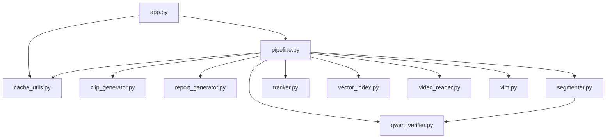
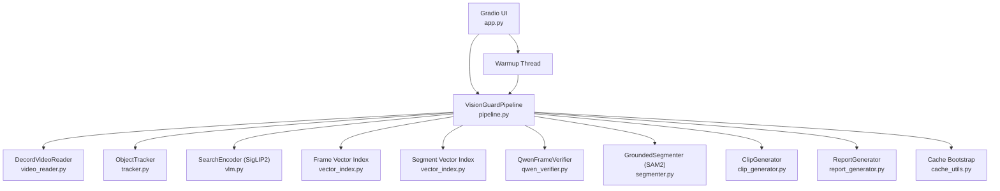
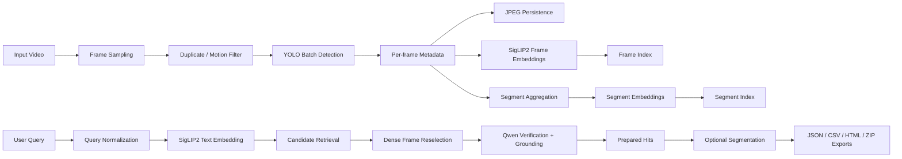
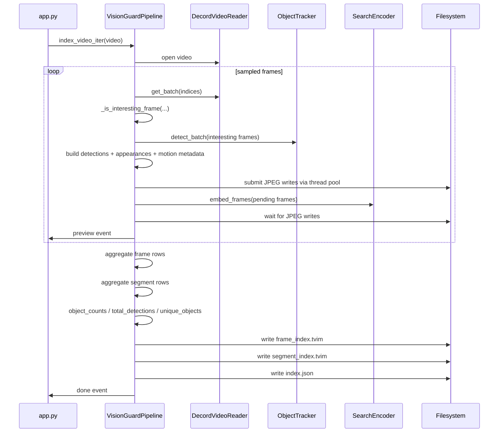
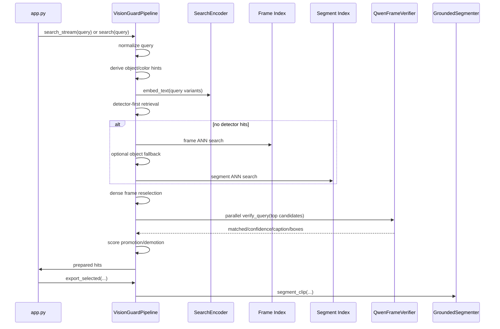

# Vision Guard: Technical Audit and Architecture Manual

This document is a deterministic, code-backed audit of the repository at `D:\CDAC_PROJECT\5.CV_Project`.

It is written from the current tracked source files, sample assets, notebook, and local repository structure only. No behavior, dependency, or architecture is described unless it is directly visible in the codebase or in tracked project artifacts.

## 1. Executive Summary

Vision Guard is a Python inference application with a Gradio user interface for scan-first CCTV video search.

The design is:

1. sample and filter frames from a video
2. run object detection on kept frames
3. persist sampled frame images and frame metadata
4. embed frames and segments with SigLIP2
5. build frame and segment search indexes
6. answer a natural-language query by combining:
   - detector metadata retrieval
   - semantic ANN retrieval
   - dense frame reselection
   - Qwen visual verification and grounding
7. optionally segment and export selected matches

The current repository does not contain:

- a training loop
- a web API service
- a database
- a queue worker system
- LangChain
- LlamaIndex
- a vector database server
- event-detection logic that is active in the runtime path

## 2. Cleanup Audit

### 2.1 Audit outcome

The tracked repository was re-scanned file by file.

- Additional definitively unused tracked files found: none
- Additional deletions executed in this pass: none
- Reason: every tracked file is either imported by runtime code, discovered by runtime code, required as configuration/docs/notebook support, or explicitly linked from tracked documentation.

### 2.2 Categories

#### `USED`

Used means imported by source code, discovered dynamically by source code, or required in a concrete documented execution path.

- `app.py`
- `pipeline.py`
- `cache_utils.py`
- `clip_generator.py`
- `qwen_verifier.py`
- `report_generator.py`
- `segmenter.py`
- `tracker.py`
- `vector_index.py`
- `video_reader.py`
- `vlm.py`
- `assets/asset1.mp4`
- `assets/asset2.mp4`
- `assets/asset3.mp4`
- `assets/asset4.mp4`
- `assets/asset5.mp4`
- `assets/asset6.mp4`
- `VisionGuard_Colab.ipynb`

#### `CRITICAL / INFRA`

Critical or infrastructure files are preserved because they define dependencies, repository behavior, or primary documentation.

- `.gitignore`
- `requirements.txt`
- `README.md`
- `PROJECT_DOCUMENTATION.md`

#### `USED AS OPTIONAL DOCUMENTATION`

These are not imported by the runtime, but they are intentionally referenced from the main repository docs and preserved as part of the repo’s documented optional integration surface.

- `optional_integrations/headroom/README.md`
- `optional_integrations/headroom/VISION_GUARD_CONTEXT.md`

#### `LOCAL INFRA PRESERVED`

These are not tracked application source files, but they are legitimate local runtime or environment infrastructure and were intentionally preserved.

- `.venv/`
- `.yolo/`
- `output/`
- `yolo11m.pt`

### 2.3 Proof summary

#### Static import graph

#### Dynamic/runtime references

- `app.py` discovers sample videos from `assets/*.mp4`
- `tracker.py` and `pipeline.py` default to `yolo11m.pt`
- `pipeline.py` writes runtime outputs under `output/`
- `README.md` and this document reference:
  - `VisionGuard_Colab.ipynb`
  - `optional_integrations/headroom/*`

### 2.4 Deletion log

No additional deletions were executed in this pass.

## 3. Repository Inventory

### 3.1 Tracked files

- `.gitignore`
- `PROJECT_DOCUMENTATION.md`
- `README.md`
- `VisionGuard_Colab.ipynb`
- `app.py`
- `cache_utils.py`
- `clip_generator.py`
- `pipeline.py`
- `qwen_verifier.py`
- `report_generator.py`
- `requirements.txt`
- `segmenter.py`
- `tracker.py`
- `vector_index.py`
- `video_reader.py`
- `vlm.py`
- `assets/asset1.mp4`
- `assets/asset2.mp4`
- `assets/asset3.mp4`
- `assets/asset4.mp4`
- `assets/asset5.mp4`
- `assets/asset6.mp4`
- `optional_integrations/headroom/README.md`
- `optional_integrations/headroom/VISION_GUARD_CONTEXT.md`

### 3.2 Local runtime / environment items observed

- `.venv/`
- `.yolo/`
- `output/`
- `yolo11m.pt`

These were preserved because they are runtime infrastructure, environment state, or ignored local assets rather than tracked source.

## 4. Top-Level Architecture

## 5. End-to-End Data Flow

### 5.1 High-level operational flow

### 5.2 Indexing pipeline detail

### 5.3 Query pipeline detail

## 6. Application Entry Point

### 6.1 `app.py`

Role: top-level Gradio process, UI layout, event wiring, and user-facing status rendering.

Responsibilities:

- initialize runtime cache behavior via `setup_cache()`
- instantiate `VisionGuardPipeline`
- launch background model warmup
- detect local versus Colab/Kaggle runtime
- decide Gradio bind host and sharing mode
- discover sample assets from `assets/*.mp4`
- stream scan progress and query results into Gradio components
- expose generated export files

Primary UI event handlers:

- `scan_only(video)`
- `find_query(q)`
- `export_selected(picks, q, hits)`
- `get_system_status()`

Important current UI behavior:

- the `info` markdown now includes object count summaries after scan completion
- the `status` markdown is reused for both warmup state and scan/query status
- only the first hit receives an overlaid gallery frame by default via `_attach_gallery_frame()`

## 7. Core Orchestrator

### 7.1 `pipeline.py`

Role: single orchestrator for scanning, indexing, retrieval, verification, segmentation, and export.

Constructor defaults:

- `out_dir="output"`
- `yolo="yolo11m.pt"`
- `clip_model="google/siglip2-so400m-patch14-384"`
- `verifier_model="Qwen/Qwen2.5-VL-7B-Instruct-AWQ"`
- `sam="facebook/sam2.1-hiera-small"`

Long-lived state:

- `self.trk`
- `self.enc`
- `self.vlm`
- `self.ver`
- `self.seg`
- `self.idx`
- `self.run_dir`
- `self.clip`
- `self.rep`
- `self.last_hits`
- `self.search_idx`
- `self.frame_idx`
- `self.pool`
- `self.raw_jobs`
- `self.seg_jobs`
- `self._warmup_failures`
- `self._warmup_done`

### 7.2 Threading model

The shared executor is currently:

- `ThreadPoolExecutor(max_workers=4)`

It is used for:

- overlapped scan-time JPEG writes
- parallel Qwen verification of top query candidates
- optional background raw-clip generation
- optional background segmentation jobs

### 7.3 Query understanding and object heuristics

The pipeline implements:

- query normalization
- small synonym replacements
- supported object extraction
- supported color extraction
- exact-object conservatism for unsupported simple labels
- explicit rejection of event-style queries

Examples of supported normalized concepts:

- `person`
- `car`
- `truck`
- `bus`
- `motorcycle`
- `bicycle`
- `umbrella`
- `backpack`
- `suitcase`
- `handbag`

Examples of color modifiers:

- `yellow`
- `white`
- `black`
- `gray`
- `red`
- `blue`
- `green`
- `orange`
- `brown`

Event-style terms intentionally rejected:

- `fight`
- `fall`
- `accident`
- `collision`
- `crowd`
- `loitering`
- `violence`
- related variants encoded in `_ABSTRACT_TERMS` and `_is_event_query()`

### 7.4 Index build algorithm

`index_video_iter(video, sample_sec=0.75, win_sec=4.5)` currently performs:

1. create a timestamped run directory
2. reset YOLO tracker state
3. open the video through `DecordVideoReader`
4. compute sample indices from `sample_sec`
5. batch-read sampled frames
6. reject near-duplicates or low-motion frames with `_is_interesting_frame()`
7. run YOLO `detect_batch()` on kept candidates
8. reject empty/non-content frames with `_is_non_content_frame()`
9. derive per-frame metadata:
   - objects
   - detections
   - vehicle color hints
   - appearance tags
   - motion score
   - keep reason
   - object delta
   - still-people heuristics
10. queue JPEG writes to the thread pool
11. run `SearchEncoder.embed_frames()` for the pending batch
12. wait for the JPEG writes to complete
13. finalize frame rows and frame embedding chunks
14. aggregate fixed-width segment rows
15. build frame and segment ANN indexes
16. write `reports/index.json`
17. emit one final metadata payload

### 7.5 Scan metadata contract

`self.idx["meta"]` contains:

- `video`
- `fps`
- `frames`
- `duration`
- `sample_sec`
- `win_sec`
- `segments`
- `object_counts`
- `total_detections`
- `unique_objects`

The final yielded Gradio payload also adds:

- `retriever`
- `segment_retriever`
- `verifier`

### 7.6 Object count feature

After all frame rows are finalized, the pipeline aggregates per-frame object labels into:

- `object_counts`: ordered by descending count
- `total_detections`: total number of counted object labels across indexed frames
- `unique_objects`: number of unique object labels seen

The UI then renders this in the scan info panel.

### 7.7 Retrieval strategy

`_candidate_hits()` currently applies the following ordered strategy:

1. detector-first retrieval
2. frame ANN retrieval
3. object-fallback retrieval
4. low-confidence clustered frame retrieval for non-strict queries
5. segment ANN retrieval

Dense frame reselection is then applied to top candidates before verification.

### 7.8 Verification and ranking

The top rows are verified through `QwenFrameVerifier.verify_query()`.

Current behavior:

- verified matches receive score boosts
- unverified captioned rows are retained but demoted
- rows without useful verifier output are demoted more strongly
- detector/object-fallback rows may still be returned as trusted fallbacks for supported object queries

### 7.9 Streaming versus non-streaming query behavior

`search_stream()`:

- verifies top candidates incrementally
- emits only confirmed rows as they become available
- falls back to trusted detector/object-fallback rows if no confirmations are emitted and the query is object-oriented

`search()`:

- verifies top candidates in one pass
- returns confirmed rows if any
- otherwise falls back to trusted detector/object-fallback rows for supported object queries

### 7.10 Export behavior

`export_selected(picks, query)`:

1. resolves chosen prepared hits
2. ensures each match has a segmented or raw clip
3. writes:
   - selected JSON
   - selected CSV
   - selected HTML
   - selected ZIP

The ZIP contains clips only:

- selected segmented clips when available
- selected raw clips as fallback or additional files

## 8. Supporting Modules

### 8.1 `cache_utils.py`

Purpose:

- configure Hugging Face and model-cache paths, primarily for Colab + Google Drive persistence

Behavior:

- copies any discovered Hugging Face token into environment variables
- attempts `huggingface_hub.login(...)`
- returns early outside `/content/drive/MyDrive`
- sets:
  - `HF_HOME`
  - `TRANSFORMERS_CACHE`
  - `HUGGINGFACE_HUB_CACHE`
  - `TORCH_HOME`
  - `YOLO_CONFIG_DIR`
  - `ULTRALYTICS_SETTINGS`

### 8.2 `clip_generator.py`

Purpose:

- create raw MP4 clips for candidate windows

Implementation details:

- uses OpenCV `VideoCapture` / `VideoWriter`
- pads clip boundaries by default
- optionally rewrites the temporary MP4 through `ffmpeg` to H.264 `yuv420p` with `+faststart`

### 8.3 `report_generator.py`

Purpose:

- serialize selected matches and index metadata as JSON, CSV, HTML, and ZIP

CSV fields:

- `rank`
- `score`
- `start`
- `end`
- `duration`
- `summary`
- `objects`
- `tracks`
- `clip`

### 8.4 `vector_index.py`

Purpose:

- wrap ANN/index behavior behind one interface

Backends:

- `turbovec` when available and build succeeds
- `numpy` fallback otherwise

Persisted artifacts:

- `frame_index.tvim`
- `segment_index.tvim`

### 8.5 `video_reader.py`

Purpose:

- abstract random and batched frame access

Behavior:

- primary path: `decord.VideoReader`
- fallback path: `cv2.VideoCapture`

Exposed methods:

- `get_frame(idx)`
- `get_batch(indices)`
- `ts_for(idx)`

### 8.6 `tracker.py`

Purpose:

- detection and tracking wrapper around Ultralytics YOLO

Current defaults:

- model: `yolo11m.pt`
- confidence: `0.22`
- image size: `640`
- tracker config: `botsort.yaml`

Important local infrastructure dependency:

- `YOLO_CONFIG_DIR` defaults into `.yolo/`

### 8.7 `vlm.py`

Purpose:

- SigLIP2 image and text embedding

Current performance behavior:

- CPU batch size: `8`
- CUDA batch size:
  - `32` on A100
  - `16` on other detected CUDA GPUs
- `embed_frames()` uses:
  - `torch.no_grad()`
  - CUDA autocast to FP16 when on GPU

Current rationale:

- image embedding dominates scan cost
- text embedding is cheap and is left simple
- `torch.compile` is intentionally disabled because of Gradio worker-thread incompatibility noted in the source comment

### 8.8 `qwen_verifier.py`

Purpose:

- exact visual query verification
- box grounding for matched visual evidence

Backends:

- `vllm`
- Hugging Face Transformers
- `dev_passthrough` on Windows CPU local development

Current performance behavior:

- default generation limit reduced to `100` tokens
- vLLM default sampling uses `max_tokens=100`
- results are cached by:
  - normalized query text
  - frame key or frame path

Verifier output contract:

- `matched`
- `confidence`
- `caption`
- `boxes`

### 8.9 `segmenter.py`

Purpose:

- translate verifier grounding into SAM2 masks and segmented clips

Behavior:

- asks Qwen for boxes through `ground_phrase()`
- falls back to detector boxes when Qwen does not localize
- segments the first two boxes per sampled segmentation frame
- returns raw clip when no grounded mask is produced

## 9. Technology Stack and Selection Rationale

### 9.1 Gradio

Chosen because the current app is a direct interactive UI with:

- streaming scan updates
- file uploads
- galleries
- tabular result rendering
- downloadable exports

### 9.2 Decord

Chosen because the scan path needs batch and random-access frame retrieval, which is used directly by:

- sampled scan batches
- dense reselection

### 9.3 Ultralytics YOLO

Chosen because the project depends on:

- inexpensive per-frame object metadata
- exact supported object class matching
- high-speed detector-first candidate generation

### 9.4 SigLIP2

Chosen because the project requires both:

- text-to-frame retrieval
- image-to-image frame reselection scoring

### 9.5 turbovec

Chosen opportunistically as an in-process ANN backend with a NumPy fallback when unavailable.

### 9.6 Qwen2.5-VL-7B-Instruct-AWQ

Chosen because the project requires:

- literal verification of the exact user query
- conservative decision-making
- localization boxes for visible evidence

### 9.7 SAM2.1 Hiera Small

Chosen because the export path requires:

- turning grounding boxes into masks
- producing human-reviewable segmented clips

## 10. Data Contracts

### 10.1 Frame row: `self.idx["frames"]`

- `frame_id: int`
- `frame: int`
- `ts: float`
- `frame_path: str`
- `representative_frame_path: str`
- `objects: list[str]`
- `appearances: list[str]`
- `tracks: list`
- `detections: list[dict]`
- `motion_score: float`
- `keep_reason: str`
- `still_people: int`
- `object_delta: int`

### 10.2 Segment row: `self.idx["segments"]`

- `seg_id`
- `start: float`
- `end: float`
- `mid: float`
- `emb`
- `frame_path: str`
- `objects: list[str]`
- `tracks: list`
- `temporal_stats: dict`
- `tags: list`

### 10.3 Prepared hit row

Prepared rows may contain:

- `query`
- `score`
- `base_score`
- `retrieval_mode`
- `cache_key`
- `start`
- `end`
- `peak_ts`
- `representative_frame_path`
- `frame_path`
- `objects`
- `tracks`
- `appearances`
- `det_boxes`
- `matched_detections`
- `summary`
- `verified_caption`
- `verified_match`
- `verify_score`
- `grounded`
- `low_confidence`
- `gallery_frame`
- `raw_clip`
- `clip`
- `frames`
- `segmented`
- `label`
- `match_id`

## 11. Environment Variables

Runtime-visible environment variables include:

- `HF_TOKEN`
- `HUGGINGFACE_TOKEN`
- `HUGGINGFACEHUB_API_TOKEN`
- `HF_HOME`
- `TRANSFORMERS_CACHE`
- `HUGGINGFACE_HUB_CACHE`
- `TORCH_HOME`
- `YOLO_CONFIG_DIR`
- `ULTRALYTICS_SETTINGS`
- `VISION_GUARD_HOST`
- `GRADIO_SHARE`
- `COLAB_RELEASE_TAG`
- `COLAB_BACKEND_VERSION`
- `COLAB_GPU`
- `JPY_PARENT_PID`
- `KAGGLE_KERNEL_RUN_TYPE`

## 12. Colab Execution Path

`VisionGuard_Colab.ipynb` currently:

1. clones or refreshes the repo under `/content/visionguard-ai`
2. mounts Google Drive
3. optionally loads `HF_TOKEN` from Colab secrets
4. configures persistent cache directories
5. installs `requirements.txt`
6. optionally prints GPU info
7. sets:
   - `VISION_GUARD_HOST=0.0.0.0`
   - `GRADIO_SHARE=1`
8. runs `python -u app.py`

The notebook examples are aligned with the current runtime behavior and emphasize supported object-oriented queries rather than disabled event-style queries.

## 13. Operational Constraints and Edge Cases

### 13.1 Event queries are intentionally disabled

Event-style query terms are rejected before retrieval. This is deliberate current behavior.

### 13.2 Unsupported exact-object labels are rejected conservatively

The runtime avoids substituting nearby classes for unsupported exact labels.

Example:

- a query like `taxi` will not be silently widened to `car`

### 13.3 Windows CPU local verification is a bypass mode

`dev_passthrough` is not fidelity-preserving inference. It exists only to make local Windows CPU development usable.

### 13.4 Segmentation is export-time only

Scan-time indexing does not run SAM2 segmentation. Segmentation is deferred until the user exports selected hits.

### 13.5 Search warmup gating

Both `search_stream()` and `search()` wait for up to 30 seconds for the verifier backend to leave the uninitialized state before proceeding.

### 13.6 Trusted fallback results

If Qwen does not confirm any match, object-oriented queries may still return detector-first or object-fallback hits.

## 14. Performance-Relevant Current Features

### 14.1 Faster indexing

Current code-backed scan optimizations:

- larger CUDA image batch sizes in `vlm.py`
- mixed-precision FP16 image embedding through autocast
- no-grad inference
- overlapped JPEG writes using the shared thread pool

### 14.2 Faster query verification

Current code-backed query optimizations:

- Qwen generation limit reduced to 100 tokens
- active verifier result cache
- parallel top-candidate verification using the shared executor

### 14.3 Object count display after indexing

The index metadata now surfaces aggregate object counts, which are rendered directly in the UI after scan completion.

## 15. Suggested Reading Order

1. `README.md`
2. `app.py`
3. `pipeline.py`
4. `tracker.py`
5. `vlm.py`
6. `qwen_verifier.py`
7. `segmenter.py`
8. `video_reader.py`
9. `clip_generator.py`
10. `report_generator.py`
11. `vector_index.py`
12. `VisionGuard_Colab.ipynb`
13. `optional_integrations/headroom/README.md`

## 16. Interview-Grade Review Questions

1. Why does the application build both frame and segment indexes instead of only one?
2. Why is detector-first retrieval useful even when semantic retrieval exists?
3. What failure mode does dense frame reselection solve?
4. Why is Qwen verification deferred until after ANN narrowing?
5. Why are unsupported exact-object labels rejected rather than loosely substituted?
6. Why are event queries currently out of scope?
7. How does the color heuristic interact with supported vehicle classes?
8. Why does the pipeline preserve trusted detector/object-fallback results even when Qwen does not confirm them?
9. Why is segmentation deferred to export time?
10. What operational tradeoffs come from the Windows CPU verifier bypass?
11. What performance benefit is gained by overlapping JPEG writes with SigLIP2 embedding?
12. Why is `torch.compile` intentionally disabled in `vlm.py`?
13. Why is the verifier cache keyed by normalized query plus frame key/path?
14. Why is the shared thread pool capped at four workers?
15. Which current notebook instructions are not behaviorally aligned with the runtime code?

## 17. Final State

The current repository is a production-style inference application with:

- a single orchestrator
- explicit model wrappers
- deterministic on-disk outputs
- current code-backed documentation
- no additional tracked files proven safe to delete

The repository remains backward-compatible with its current runtime structure, and the main documentation now reflects the actual implementation rather than older intermediate states.
