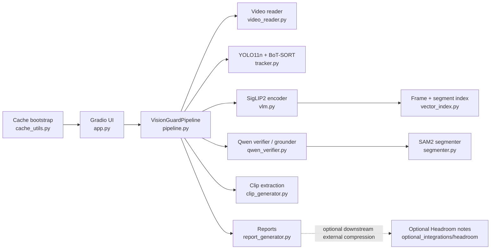
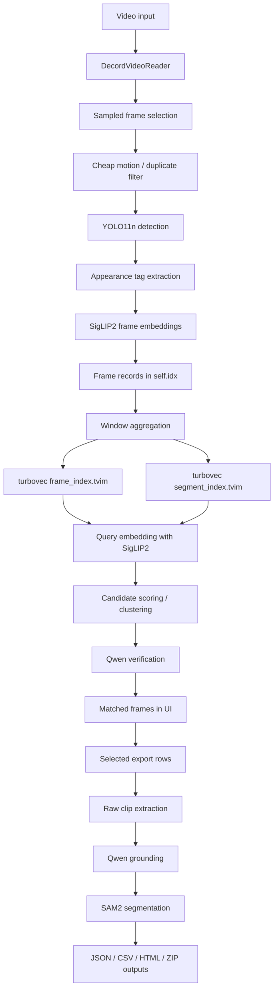

# Vision Guard Project Documentation

This document is a code-evidenced description of the current repository state.
It is written from the tracked files in this project and does not describe unimplemented ideas as shipped behavior.

## 1. Project Identity

Project name: `Vision Guard`

Primary purpose:

- scan a surveillance-style video once
- build a searchable visual index
- accept natural-language queries after scanning
- return matched frames and timestamped clip windows
- export selected results as clips and reports

Primary user flow:

1. Upload a video or choose a bundled sample.
2. Click `step 1: scan video`.
3. Wait for indexing to complete.
4. Enter a natural-language query.
5. Click `step 2: find matches`.
6. Review matched frames, timestamps, and summaries.
7. Export only the selected matches.

This repository is an inference application.
It does not contain a training loop, fine-tuning pipeline, dataset curation pipeline, or model-serving backend separate from the Gradio app.

## 2. Repository Inventory

Tracked project files:

- [app.py](D:/CDAC_PROJECT/CV_Project/app.py)
- [cache_utils.py](D:/CDAC_PROJECT/CV_Project/cache_utils.py)
- [clip_generator.py](D:/CDAC_PROJECT/CV_Project/clip_generator.py)
- [pipeline.py](D:/CDAC_PROJECT/CV_Project/pipeline.py)
- [PROJECT_DOCUMENTATION.md](D:/CDAC_PROJECT/CV_Project/PROJECT_DOCUMENTATION.md)
- [qwen_verifier.py](D:/CDAC_PROJECT/CV_Project/qwen_verifier.py)
- [README.md](D:/CDAC_PROJECT/CV_Project/README.md)
- [report_generator.py](D:/CDAC_PROJECT/CV_Project/report_generator.py)
- [requirements.txt](D:/CDAC_PROJECT/CV_Project/requirements.txt)
- [segmenter.py](D:/CDAC_PROJECT/CV_Project/segmenter.py)
- [tracker.py](D:/CDAC_PROJECT/CV_Project/tracker.py)
- [vector_index.py](D:/CDAC_PROJECT/CV_Project/vector_index.py)
- [video_reader.py](D:/CDAC_PROJECT/CV_Project/video_reader.py)
- [VisionGuard_Colab.ipynb](D:/CDAC_PROJECT/CV_Project/VisionGuard_Colab.ipynb)
- [vlm.py](D:/CDAC_PROJECT/CV_Project/vlm.py)
- [optional_integrations/headroom/README.md](D:/CDAC_PROJECT/CV_Project/optional_integrations/headroom/README.md)
- bundled sample videos under `assets/`

Tracked config/infrastructure files:

- [.gitignore](D:/CDAC_PROJECT/CV_Project/.gitignore)
- [requirements.txt](D:/CDAC_PROJECT/CV_Project/requirements.txt)
- [VisionGuard_Colab.ipynb](D:/CDAC_PROJECT/CV_Project/VisionGuard_Colab.ipynb)

Not present in the tracked repository:

- `pyproject.toml`
- `setup.py`
- `package.json`
- `Dockerfile`
- GitHub Actions workflows
- unit test suite
- lint configuration
- formal model evaluation scripts

## 3. Technology Stack

### 3.1 Application layer

- `Python`
- `Gradio`

Why used:

- the project is implemented entirely in Python
- Gradio provides a fast local, Colab, and Spaces-friendly UI
- no separate frontend build system is required

### 3.2 Vision and video processing

- `opencv-python-headless`
- `decord`
- `Pillow`
- `numpy`

Why used:

- OpenCV handles frame conversion, drawing, clip writing, and video metadata access
- Decord is used as the preferred scan-time video reader for faster random and batched frame access
- Pillow is required by the Hugging Face vision processors and the Qwen verifier
- NumPy is the primary tensor-like data container outside Torch

### 3.3 Detection and tracking

- `ultralytics`
- `lap`
- YOLO11n
- BoT-SORT

Why used:

- Ultralytics provides YOLO inference and tracking APIs
- `lap` is a known dependency used by Ultralytics tracking components
- YOLO11n is the current detector path used by [tracker.py](D:/CDAC_PROJECT/CV_Project/tracker.py)
- BoT-SORT is the configured tracker backend string in `ObjectTracker`

### 3.4 Retrieval and multimodal reasoning

- `torch`
- `torchvision`
- `transformers`
- `accelerate`
- `qwen-vl-utils`
- `vllm` on non-Windows platforms
- SigLIP2 So400m
- Qwen2.5-VL-7B-Instruct-AWQ
- SAM2.1-hiera-small

Why used:

- PyTorch is the runtime for all neural models
- Transformers is used to load SigLIP2, Qwen2.5-VL, and SAM2
- Accelerate supports modern Hugging Face model loading flows
- `qwen-vl-utils` provides `process_vision_info` for the Qwen image-message path
- `vllm` is conditionally installed outside Windows and is used as the preferred Qwen inference backend when available on CUDA
- SigLIP2 is used for text-image embedding retrieval
- Qwen2.5-VL is used for shortlist verification and phrase grounding
- SAM2 is used for segmentation after grounding

### 3.5 Indexing and reporting

- `turbovec`
- `jinja2`
- Python `json`, `csv`, `zipfile`

Why used:

- turbovec provides approximate nearest-neighbor indexing through `IdMapIndex`
- Jinja2 renders the HTML report
- JSON, CSV, and ZIP are the export formats implemented in code

## 4. Dependency Inventory

The exact tracked dependency list is in [requirements.txt](D:/CDAC_PROJECT/CV_Project/requirements.txt):

```text
gradio>=5.0.0
turbovec
ultralytics>=8.3.0
lap>=0.5.13
torch>=2.4.0
torchvision>=0.19.0
transformers>=4.57.0
accelerate>=1.0.0
qwen-vl-utils>=0.0.8
vllm>=0.8.5; platform_system != "Windows"
decord>=0.6.0
opencv-python-headless>=4.9.0.80
numpy>=1.26.4
Pillow>=10.3.0
jinja2>=3.1.0
```

## 5. Runtime Architecture



### 5.1 Architectural properties

- single-process Python application
- Gradio-hosted user interface
- scan-first pipeline
- no remote vector database
- no separate API service layer
- no background queue system
- local filesystem output storage
- local in-memory query state for the current scanned video

## 6. Entry Points And Execution Modes

### 6.1 Local app entrypoint

File: [app.py](D:/CDAC_PROJECT/CV_Project/app.py)

Entrypoint:

- `if __name__ == "__main__": demo.launch(...)`

Behavior:

- runs `setup_cache()`
- constructs a global `VisionGuardPipeline`
- starts `pipe.warmup_models()` in a background daemon thread
- launches a Gradio Blocks UI

### 6.2 Colab execution mode

File: [VisionGuard_Colab.ipynb](D:/CDAC_PROJECT/CV_Project/VisionGuard_Colab.ipynb)

Behavior:

- clones or pulls the GitHub repo
- mounts Google Drive
- sets cache environment variables under `/content/drive/MyDrive/visionguard_cache`
- optionally loads `HF_TOKEN` from Colab secrets
- installs dependencies
- sets:
  - `VISION_GUARD_HOST=0.0.0.0`
  - `GRADIO_SHARE=1`
- launches `python -u app.py`
- instructs the user to open the printed `gradio.live` URL

### 6.3 Optional integration mode

File: [optional_integrations/headroom/README.md](D:/CDAC_PROJECT/CV_Project/optional_integrations/headroom/README.md)

This is documentation only.
It does not alter the shipped runtime.

## 7. Configuration Surface

### 7.1 Environment variables used directly by the code

From [app.py](D:/CDAC_PROJECT/CV_Project/app.py) and [cache_utils.py](D:/CDAC_PROJECT/CV_Project/cache_utils.py):

- `VISION_GUARD_HOST`
- `GRADIO_SHARE`
- `COLAB_RELEASE_TAG`
- `COLAB_BACKEND_VERSION`
- `COLAB_GPU`
- `JPY_PARENT_PID`
- `KAGGLE_KERNEL_RUN_TYPE`
- `HF_TOKEN`
- `HUGGINGFACE_TOKEN`
- `HUGGINGFACEHUB_API_TOKEN`
- `HF_HOME`
- `TRANSFORMERS_CACHE`
- `HUGGINGFACE_HUB_CACHE`
- `TORCH_HOME`
- `YOLO_CONFIG_DIR`
- `ULTRALYTICS_SETTINGS`

### 7.2 Ignored local/runtime artifacts

From [.gitignore](D:/CDAC_PROJECT/CV_Project/.gitignore):

- `__pycache__/`
- `.pycache_tmp/`
- `.yolo/`
- `output/`
- `yolo11n.pt`
- `yolo11m.pt`
- `.venv`

These are treated as local caches, generated outputs, or local environment files rather than tracked source.

## 8. End-To-End Data Flow



## 9. UI Layer

File: [app.py](D:/CDAC_PROJECT/CV_Project/app.py)

### 9.1 UI components

Left column:

- `gr.Video` input
- `gr.Examples` of sample assets
- scan button
- status markdown
- live indexing preview image
- scan metadata markdown
- query textbox
- searched-terms markdown
- find button

Right column:

- answer markdown
- result dataframe
- export selection checkbox group
- export button
- zip file output
- html report output
- csv report output
- matched frames gallery
- result note markdown

### 9.2 App-level helper functions

`_in_colab()`

- input: none
- output: `bool`
- purpose: infer whether the app is running inside Colab

`_server_name()`

- input: none
- output: `str`
- purpose: choose `127.0.0.1` locally or `0.0.0.0` in hosted notebook environments, unless overridden

`_share_enabled()`

- input: none
- output: `bool`
- purpose: parse `GRADIO_SHARE`

`_sample_videos()`

- input: none
- output: list of sample asset paths
- purpose: expose `assets/*.mp4` to Gradio examples

`scan_only(video)`

- input: uploaded video path
- output: Gradio generator yields status text, preview image, metadata markdown, query state, and hits state
- purpose: drive scan-time UI updates

`find_query(q)`

- input: query string
- output: Gradio generator yields search status, answer text, searched variants, table rows, export choices, gallery, notes, and file reset states
- purpose: drive query-time streaming results

`export_selected(picks, q, hits)`

- input:
  - selected labels
  - query string
  - in-memory hit rows
- output:
  - zip file
  - html report
  - csv report

## 10. Cache And Environment Bootstrap

File: [cache_utils.py](D:/CDAC_PROJECT/CV_Project/cache_utils.py)

### 10.1 `_setup_hf_token()`

Reads one of:

- `HF_TOKEN`
- `HUGGINGFACE_TOKEN`
- `HUGGINGFACEHUB_API_TOKEN`

If present:

- sets default token environment variables
- attempts `huggingface_hub.login(token=..., add_to_git_credential=False)`

### 10.2 `setup_cache()`

Behavior:

- assumes Colab Drive cache root `/content/drive/MyDrive/visionguard_cache`
- returns immediately if `/content/drive/MyDrive` does not exist
- otherwise configures:
  - `HF_HOME`
  - `TRANSFORMERS_CACHE`
  - `HUGGINGFACE_HUB_CACHE`
  - `TORCH_HOME`
  - `YOLO_CONFIG_DIR`
  - `ULTRALYTICS_SETTINGS`
- ensures those directories exist

## 11. Video Reader

File: [video_reader.py](D:/CDAC_PROJECT/CV_Project/video_reader.py)

Class: `DecordVideoReader`

### 11.1 Constructor

Input:

- `path`: video file path

Behavior:

- tries to create a Decord `VideoReader`
- falls back to `cv2.VideoCapture` if Decord fails
- exposes:
  - `fps`
  - `count`
  - `width`
  - `height`
  - `use_decord`

### 11.2 Methods

`__len__()`

- returns frame count

`get_frame(idx)`

- input: integer frame index
- output: BGR frame or `None`

`get_batch(indices)`

- input: iterable of frame indices
- output: list of BGR frames

`ts_for(idx)`

- input: frame index
- output: timestamp in seconds

## 12. Detection And Tracking Layer

File: [tracker.py](D:/CDAC_PROJECT/CV_Project/tracker.py)

Class: `ObjectTracker`

### 12.1 Constructor defaults

- `model="yolo11n.pt"`
- `conf=0.22`
- `imgsz=512`
- `tracker="botsort.yaml"`

### 12.2 State

- `self.model_name`
- `self.conf`
- `self.imgsz`
- `self.tracker`
- `self.dev`
- `self.use_half`
- `self.m`

### 12.3 Model loading behavior

`_cached_model_path()`

- if the model name includes a directory, use it directly
- otherwise, in Colab, prefer `/content/drive/MyDrive/visionguard_cache/ultralytics/weights/<model>`
- if no cached model exists, use the bare model name and allow Ultralytics to resolve/download it

`load()`

- instantiates `YOLO(model_path)`
- copies a freshly downloaded local YOLO file into the Drive cache when possible
- moves the model to the selected device

### 12.4 Public methods

`reset()`

- sets the internal YOLO model handle back to `None`

`class_ids(names)`

- input: logical class names
- output: matching numeric class ids from the YOLO model

`names()`

- output: class id to label mapping

`track(frame, cls=None)`

- input:
  - a frame
  - optional class filter
- output: list of dicts with:
  - `id`
  - `box`
  - `conf`
  - `cls`
  - `name`

`detect(frame, cls=None, conf=None)`

- single-frame detection
- output rows contain:
  - `box`
  - `conf`
  - `cls`
  - `name`

`detect_batch(frames, cls=None, conf=None)`

- batch detection path used by scan-time indexing
- output: per-frame list of detection rows

## 13. Embedding Layer

File: [vlm.py](D:/CDAC_PROJECT/CV_Project/vlm.py)

Class: `SearchEncoder`

### 13.1 Constructor defaults

- `model="google/siglip2-so400m-patch14-384"`

### 13.2 Loading behavior

`load()`

- loads `AutoProcessor`
- loads `AutoModel`
- moves the model to the selected device
- sets eval mode
- attempts `torch.compile()` on `vision_model` when on CUDA

### 13.3 Embedding behavior

`embed_text(txt)`

- prefixes the text with `this is a photo of ...`
- returns a normalized `float32` vector

`embed_frame(frame)`

- converts BGR frame to RGB PIL image
- returns a normalized `float32` vector

`embed_frames(frames)`

- batched image embedding path
- uses:
  - `image_batch_size=24` on CUDA
  - `image_batch_size=8` on CPU

## 14. Vector Index Layer

File: [vector_index.py](D:/CDAC_PROJECT/CV_Project/vector_index.py)

Class: `SegmentVectorIndex`

### 14.1 Purpose

This class is used twice in the pipeline:

- `self.frame_idx` for frame retrieval
- `self.search_idx` for segment retrieval

### 14.2 Behavior

If `turbovec.IdMapIndex` is available:

- builds an ANN index
- calls `add_with_ids(...)`
- calls `prepare()`
- optionally writes `.tvim` index files

If turbovec is unavailable or index creation fails:

- falls back to NumPy dot-product retrieval

### 14.3 Public methods

`build(vectors, ids, path=None)`

- input: `2D float32` vectors and `uint64` ids
- side effects:
  - stores vectors and ids
  - optionally writes a `.tvim` index

`build_merged(chunks, path=None)`

- merges vector/id chunks
- then delegates to `build(...)`

`search(query, k)`

- input:
  - query embedding
  - top-k count
- output:
  - scores
  - ids

## 15. Qwen Verification And Grounding Layer

File: [qwen_verifier.py](D:/CDAC_PROJECT/CV_Project/qwen_verifier.py)

Class: `QwenFrameVerifier`

### 15.1 Backends

The verifier can run in two backends:

- `vllm`
- Hugging Face Transformers

Selection logic:

- if device is CUDA, try `vllm` first
- if `vllm` load fails, fall back to Hugging Face
- if both fail, mark the verifier as failed

### 15.2 State

- `model_name`
- `dev`
- `model`
- `processor`
- `process_vision_info`
- `vllm_engine`
- `vllm_sampling`
- `backend`
- `failed`
- `cache`
- `lock`

### 15.3 Prompting behavior

`verify_query(frame_path, query, frame_key=None)` asks the model to return JSON with:

- `matched`
- `confidence`
- `description`
- `boxes`

Post-processing rules:

- confidence is clamped to `[0, 1]`
- if `confidence < 0.45`, `matched` is forced to `False`
- returned boxes are normalized into pixel coordinates

### 15.4 Public methods

`load()`

- ensure backend is loaded

`warmup()`

- preloads the verifier

`verify_query(frame_path, query, frame_key=None)`

- input:
  - frame image path
  - raw query string
  - optional stable cache key
- output dict:
  - `matched`
  - `confidence`
  - `caption`
  - `boxes`

`ground_phrase(frame_path, phrase, multi=True, frame_key=None)`

- returns boxes if `verify_query(...)` confirms the phrase
- returns empty list otherwise

## 16. Segmentation Layer

File: [segmenter.py](D:/CDAC_PROJECT/CV_Project/segmenter.py)

Class: `GroundedSegmenter`

### 16.1 Purpose

This class turns already-selected matches into:

- grounded boxes
- masks
- segmented overlay frames
- segmented export clips

### 16.2 Loading behavior

`load()`

- lazily loads `Sam2Processor`
- lazily loads `Sam2Model`

### 16.3 Public methods

`detect(frame_path, query, fallback_boxes=None)`

- input:
  - frame image path
  - query string
  - optional fallback boxes
- behavior:
  - first asks Qwen to ground the phrase
  - if Qwen returns nothing, uses `fallback_boxes`
- output:
  - boxes
  - scores
  - repeated query texts

`segment(frame, boxes)`

- input:
  - frame array
  - boxes
- output:
  - boolean mask list

`overlay(frame, boxes, scores, masks)`

- draws masks, rectangles, and numeric scores on top of the frame

`segment_clip(video, query, out_path, frame_dir, stride=3, fallback_boxes=None)`

- input:
  - raw clip path
  - query string
  - destination path
  - frame directory
  - frame stride
  - optional fallback boxes
- output:
  - segmented clip path
  - saved segmented frame preview paths
  - count of frames where boxes were found

### 16.4 Important runtime behavior

- segmentation runs on every `stride`-th frame of the selected clip
- only the first two boxes are segmented and overlaid
- if no boxes are found across the clip, the raw clip is preserved and a fallback frame is saved

## 17. Clip Generation Layer

File: [clip_generator.py](D:/CDAC_PROJECT/CV_Project/clip_generator.py)

Class: `ClipGenerator`

### 17.1 Purpose

Builds timestamped MP4 clips for selected search results.

### 17.2 Public methods

`clip_path(video, st, ed, name, pad=2.0)`

- computes the deterministic clip filename without writing the clip

`extract_clip(video, st, ed, name, pad=2.0)`

- writes the clip using OpenCV
- writes to a temporary `.part.mp4`
- optionally finalizes the clip through `ffmpeg` into H.264 with `yuv420p` and `+faststart`

### 17.3 Finalization behavior

If `ffmpeg` exists:

- transcode to browser-friendly H.264

If `ffmpeg` does not exist or conversion fails:

- keep the OpenCV-written MP4

## 18. Reporting Layer

File: [report_generator.py](D:/CDAC_PROJECT/CV_Project/report_generator.py)

Class: `ReportGenerator`

### 18.1 Export methods

`write_json(path, data)`

- serializes arbitrary export data

`write_csv(path, rows)`

- writes columns:
  - `rank`
  - `score`
  - `start`
  - `end`
  - `duration`
  - `summary`
  - `objects`
  - `tracks`
  - `clip`

`write_html(path, data)`

- renders a Jinja2 HTML page with:
  - query
  - video
  - generation timestamp
  - match table

`write_zip(path, files)`

- zips existing files only

## 19. Pipeline Orchestrator

File: [pipeline.py](D:/CDAC_PROJECT/CV_Project/pipeline.py)

Class: `VisionGuardPipeline`

This is the main backend controller.
It coordinates scanning, indexing, searching, verification, clip creation, segmentation, and report export.

### 19.1 Constructor dependencies

The constructor creates:

- `self.trk = ObjectTracker(...)`
- `self.enc = SearchEncoder(...)`
- `self.vlm = self.enc`
- `self.ver = QwenFrameVerifier(...)`
- `self.seg = GroundedSegmenter(...)`
- `self.search_idx = SegmentVectorIndex(bit_width=4)`
- `self.frame_idx = SegmentVectorIndex(bit_width=4)`
- `self.pool = ThreadPoolExecutor(max_workers=2)`

### 19.2 Query normalization and alias logic

Implemented through:

- `_normalize_query`
- `_q_objs`
- `_query_colors`
- `_query_variants`

Evidence-based behavior:

- plural normalization exists for objects like `cars`, `trucks`, `buses`, `umbrellas`
- `bike`-related terms are normalized toward `motorcycle` or `bicycle` depending on the rule path
- special expansion groups exist for:
  - `accident`
  - `collision`
  - `crash`
  - `fight`
  - `fall`
  - `crowd`
  - `loitering`

### 19.3 Color tagging logic

Vehicle-like detections can receive appearance tags such as:

- `yellow car`
- `white truck`
- `blue bus`

This is implemented by:

- `_estimate_color`
- `_appearance_tags`

Only these object types are color-tagged:

- `car`
- `truck`
- `bus`
- `motorcycle`
- `bicycle`

### 19.4 Scan flow

Primary method:

- `index_video_iter(video, sample_sec=1.25, win_sec=4.5)`

Inputs:

- source video path
- sampling interval
- window size

Outputs:

- generator events of two kinds:
  - preview events
  - done event

Preview event structure:

- `kind="preview"`
- `image`
- `status`

Done event structure:

- `kind="done"`
- `meta`
- `index_json`

### 19.5 Scan internals

The scan process does the following:

1. Create a new timestamped run directory.
2. Reset the detector/tracker state.
3. Open the video with `DecordVideoReader`.
4. Compute frame step from `sample_sec * fps`.
5. Read sampled frames in batches.
6. Apply `_is_interesting_frame(...)` using cheap grayscale thumbnail differences.
7. Skip non-content frames using `_is_non_content_frame(...)`.
8. Run batch detection on surviving sampled frames.
9. Extract object metadata, color tags, and motion metadata.
10. Save each kept frame as a JPEG in `frames/`.
11. Batch-embed kept frames with SigLIP2.
12. Aggregate frames into fixed windows.
13. Build frame and segment vector indexes.
14. Write `reports/index.json`.

### 19.6 Stored in-memory index shape

After scan completes, `self.idx` contains:

- `video`
- `meta`
- `frames`
- `segments`

`meta` contains:

- `video`
- `fps`
- `frames`
- `duration`
- `sample_sec`
- `win_sec`
- `segments`

Each frame record contains:

- `frame_id`
- `frame`
- `ts`
- `frame_path`
- `representative_frame_path`
- `objects`
- `appearances`
- `tracks`
- `detections`
- `motion_score`
- `keep_reason`
- `still_people`
- `object_delta`

Each segment record contains:

- `seg_id`
- `start`
- `end`
- `mid`
- `emb`
- `frame_path`
- `objects`
- `tracks`
- `temporal_stats`
- `tags`

### 19.7 Retrieval flow

Primary methods:

- `search_stream(raw_q, top_k=4)`
- `search(q, top_k=4)`

Both rely on `_candidate_hits(...)`.

Candidate generation order:

1. detector-refined hits for recognized object queries
2. frame ANN retrieval from `frame_idx`
3. fallback object hits from stored frame metadata
4. segment ANN retrieval from `search_idx`

### 19.8 Detector-first query path

Method:

- `_refine_detector_hits(q, top_k)`

This path is used when the query can be mapped to YOLO-supported classes.

Behavior:

- map query terms to detector classes
- filter detections by object names and optional query colors
- score matches using detection confidence and number of matched detections
- build preliminary hits

### 19.9 Embedding-first query path

Method:

- `_candidate_hits(raw_q, top_k=4)`

Behavior:

- embed the expanded query through SigLIP2
- search `frame_idx`
- rescore candidates with:
  - object overlap boosts
  - color-tag boosts
  - event-word heuristics for vehicle-related accident terms
  - `sitting` boost when `person` is detected
- cluster nearby frame hits into windows

### 19.10 Query-time frame reselection

Method:

- `_apply_reselection(...)`

Behavior:

- for top hits only
- reread the raw video between `start` and `end`
- step through frames at `0.1s`
- embed each candidate frame
- choose the best-scoring frame for the query vector
- replace the representative frame with the better frame

### 19.11 Verification flow

Methods:

- `_verify_rows(...)`
- `_verify_rows_stream(...)`

Behavior:

- run Qwen verification on only the top subset of candidate rows
- apply score boosts for confirmed matches
- downgrade or mark low confidence for unverified candidates
- preserve detected boxes or grounded boxes in `det_boxes`

Confirmation rule:

- only rows with `verified_match` are returned as strong matches by:
  - `_confirmed_rows(...)`
  - `search(...)`
  - `search_stream(...)`

### 19.12 Weak-match behavior

If the system cannot produce confirmed strong matches:

- weak visual candidates may still be assembled internally
- they are labeled with `low_confidence`
- the UI text communicates that these are not strong matches

### 19.13 Hit preparation for UI

Method:

- `prepare_hits(hits, query)`

Behavior:

- assigns `match_id`
- initializes export fields
- builds `label`
- optionally attaches a boxed gallery frame for the first result

Prepared hit fields include:

- `match_id`
- `raw_clip`
- `clip`
- `frames`
- `segmented`
- `label`
- `gallery_frame`

### 19.14 Export flow

Method:

- `export_selected(picks, query)`

Behavior:

1. filter `self.last_hits` by selected labels
2. ensure each row has a segmented or fallback clip
3. write JSON report
4. write CSV report
5. write HTML report
6. write ZIP bundle containing clip files

Return value:

- `(zipf, html, csv)`

### 19.15 Background clip jobs

The pipeline owns:

- `raw_jobs`
- `seg_jobs`
- `ThreadPoolExecutor(max_workers=2)`

The current export path uses synchronous completion for selected rows through `_ensure_segment(...)`.
The executor exists to support asynchronous clip/segmentation job handling.

### 19.16 Warmup behavior

Method:

- `warmup_models()`

Behavior:

- attempts `self.trk.load()`
- attempts `self.enc.load()`
- attempts `self.ver.warmup()`

Exceptions are swallowed in warmup.

## 20. File And Directory Outputs

Generated run structure:

- `output/<video_name>_<timestamp>/frames/`
- `output/<video_name>_<timestamp>/clips/`
- `output/<video_name>_<timestamp>/reports/`
- `output/<video_name>_<timestamp>/segments/`

Generated report artifacts include:

- `reports/index.json`
- `reports/frame_index.tvim`
- `reports/segment_index.tvim`
- `reports/selected_<timestamp>.json`
- `reports/selected_<timestamp>.csv`
- `reports/selected_<timestamp>.html`
- `reports/selected_<timestamp>.zip`

Generated clip artifacts include:

- raw clip MP4s
- segmented clip MP4s

Generated frame artifacts include:

- sampled frame JPEGs
- gallery frame overlays
- reselected frame JPEGs
- segmentation preview JPEGs

## 21. Inputs And Outputs By Module

| Module | Primary inputs | Primary outputs |
|---|---|---|
| `app.py` | video path, query string, selected result labels | UI updates, file downloads |
| `cache_utils.py` | environment variables | configured cache environment |
| `video_reader.py` | video path, frame indices | BGR frames, timestamps |
| `tracker.py` | frames, optional class filters | detections and tracked objects |
| `vlm.py` | text, frames | normalized embedding vectors |
| `vector_index.py` | vectors, ids, query vector | ANN scores and ids |
| `qwen_verifier.py` | frame path, query string | match verdict, confidence, caption, boxes |
| `segmenter.py` | clip path, frame path, query, fallback boxes | masks, overlays, segmented clips |
| `clip_generator.py` | video path, time bounds, clip name | MP4 clips |
| `report_generator.py` | hit rows, metadata | JSON, CSV, HTML, ZIP |
| `pipeline.py` | source video, query, selections | indexed state, matched hits, exported files |

## 22. Operational Characteristics

### 22.1 Persistence model

- scan results are written to the local filesystem
- current searchable state is kept in memory in `self.idx`
- there is no database
- there is no persistence layer for multi-video history

### 22.2 Query scope

- one scanned video at a time
- repeated queries against the current in-memory index

### 22.3 Device behavior

- CPU fallback exists throughout the stack
- CUDA is preferred when available
- `vllm` is only intended for non-Windows environments per dependency marker

## 23. Known Limitations From Code Evidence

These are code-evidenced limitations, not general opinions.

### 23.1 One-video working set

The pipeline stores a single active `self.idx`.
There is no multi-video searchable corpus in the current implementation.

### 23.2 No test suite

The tracked repo has no test files or test runner configuration.

### 23.3 No CI or packaging metadata

There is no tracked CI workflow, Dockerfile, or Python packaging metadata.

### 23.4 Temporal-event accuracy is heuristic

The code includes query expansion and vehicle-related scoring boosts for terms like:

- `accident`
- `collision`
- `crash`
- `fight`
- `fall`
- `crowd`
- `loitering`

But there is no dedicated temporal event classifier in the tracked code.

### 23.5 Color tagging scope is narrow

Color tagging only applies to:

- `car`
- `truck`
- `bus`
- `motorcycle`
- `bicycle`

It is not a general attribute recognition system for all objects.

### 23.6 Segmentation happens only at export time

The system does not run full-video segmentation during scanning.

### 23.7 Qwen match threshold

Verification confidence below `0.45` is treated as non-match.
This is a hardcoded threshold in [qwen_verifier.py](D:/CDAC_PROJECT/CV_Project/qwen_verifier.py).

### 23.8 Sampled scan tradeoff

The scan interval is `1.25s` by default, so sub-second events can be missed at scan time.

## 24. Documented Runtime Bug Fixed During This Audit

While auditing the code, one actual implementation issue was found and fixed in [pipeline.py](D:/CDAC_PROJECT/CV_Project/pipeline.py):

- `index_chunk_size` was referenced during segment chunk flushing without being defined anywhere.

Safe fix applied:

- removed the undefined conditional flush branch
- preserved final chunk aggregation logic

This fix affects implementation correctness, not intended architecture.

## 25. Optional Headroom Integration

Headroom is documented in:

- [optional_integrations/headroom/README.md](D:/CDAC_PROJECT/CV_Project/optional_integrations/headroom/README.md)

Current status:

- not imported by runtime code
- not part of scan/search/export behavior
- removable without changing the core app

Intended future use, as documented:

- optional external context compression for reports, logs, or agent workflows

## 26. Senior-Level Technical Interview Questions

### Architecture

1. Why is the system designed as scan-first instead of query-first?
2. Why are detection, retrieval, verification, and segmentation split across separate model stages?
3. Why is there no persistent database or multi-video corpus layer in the current design?
4. What are the tradeoffs of keeping `self.idx` in memory?
5. Why are there two vector indexes, one for frames and one for segments?

### Data flow and retrieval

6. How does frame-level retrieval differ from segment-level retrieval in this implementation?
7. Why does the system rerun fine-grained frame selection inside matched windows after ANN retrieval?
8. What are the scoring heuristics layered on top of embedding similarity?
9. Why are weak matches handled separately from confirmed matches?
10. How does the query-expansion logic affect recall and precision?

### Detection and metadata

11. Why is YOLO11n used instead of a larger detector in the tracked implementation?
12. What role does BoT-SORT play here, and what is not yet implemented around tracking continuity?
13. Why are appearance tags restricted to vehicle-like classes?
14. How does the color-estimation logic work, and where can it fail?
15. Why does the scan pipeline keep object names and detections even though Qwen performs final verification?

### Verification and grounding

16. Why use Qwen2.5-VL for both verification and grounding?
17. Why is the verifier asked to return structured JSON instead of free text?
18. What are the risks of using a hardcoded confidence threshold of `0.45`?
19. Why can a grounded query still fail even when retrieval is semantically good?
20. What happens if `vllm` is unavailable on a CUDA machine?

### Segmentation and export

21. Why is SAM2 only used after a hit is selected for export?
22. Why does the segmenter operate every `stride=3` frames instead of every frame?
23. Why does the export path keep the raw clip when no grounded mask is found?
24. Why are temporary `.part.mp4` files used before finalizing outputs?
25. Why does the system try `ffmpeg` transcoding after OpenCV clip writing?

### Scaling and bottlenecks

26. What are the main scan-time bottlenecks in this implementation?
27. What are the main query-time bottlenecks?
28. How would this architecture behave on a two-hour video?
29. What would need to change to support multiple indexed videos in one session?
30. What would need to change to support concurrent users safely?

### Reliability and production-readiness

31. What are the risks of running the full pipeline in one Python process?
32. How would you introduce automated regression tests into this repo?
33. Which parts of the pipeline are easiest to unit test without GPU access?
34. What should be monitored in production if this moved beyond Colab demos?
35. Where are failures currently swallowed, and what are the tradeoffs?

### Colab and deployment

36. Why does the code detect Colab and Kaggle explicitly?
37. Why is Drive-backed cache setup important for this model stack?
38. What are the limitations of relying on `gradio.live` links for notebook demos?
39. How would you migrate this from a Colab demo to a more stable hosted deployment?
40. Which repository assumptions are tightly coupled to Colab paths?

## 27. Questions And Answers For Practice

### What does Vision Guard actually do?

It scans one video, builds a searchable index of sampled frames and windows, accepts natural-language queries, verifies top candidates with Qwen, and exports selected clips and reports.

### Why are there both frame and segment indexes?

The frame index is the primary search path for fine-grained retrieval.
The segment index is a coarser fallback over aggregated windows.

### Why is the first matched frame sometimes different from the sampled frame that was originally indexed?

Because the pipeline rereads the matched time window at finer temporal resolution and replaces the representative frame with the locally best frame for the query.

### Why can collision or fight detection still be wrong?

Because the code does not include a dedicated temporal incident classifier.
Those query types are supported through retrieval, heuristics, and frame verification rather than a specialized event model.

### What happens if Qwen cannot ground a region?

The system falls back to detector boxes when available.
If no usable segmentation is found during export, it keeps the raw clip.

### Is Headroom part of the runtime pipeline?

No.
It is documented separately as an optional external context-compression layer and is not imported by the main app.

## 28. Maintenance Checklist

Update this document whenever any of the following change:

- dependency list
- default models
- environment variables
- notebook launch flow
- scan interval
- export artifacts
- module interfaces
- query heuristics
- file inventory

If a new tracked file is added to the repo, it should appear in Section 2 and the architecture or module sections if it is part of the runtime.
