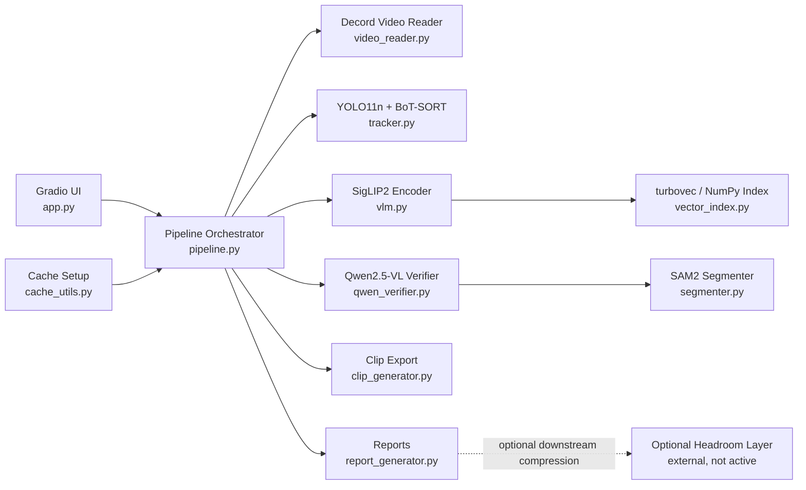
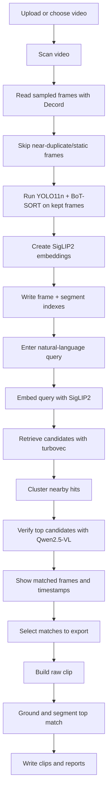

# Vision Guard Project Documentation

This is the canonical documentation for the current repository state.
If the code changes, update this file first so the description stays aligned with the implementation.

## 1. What Vision Guard Is

Vision Guard is a scan-first CCTV video search system.

It is designed for this workflow:

1. Upload a surveillance-style video.
2. Scan it once.
3. Ask natural-language questions about the scanned video.
4. Review matched frames, timestamps, and clip windows.
5. Export only the results you want.

The app is optimized for repeated review of the same video.
It is not a training pipeline.

## 2. What Problem It Solves

Long CCTV footage is expensive to inspect manually.
Vision Guard reduces that burden by turning a video into a searchable visual index.

Typical queries:

- `person sitting near gate`
- `white car entering`
- `yellow car`
- `fight near road`
- `car accident`
- `crowd near entrance`

The project helps locate likely matching parts of the video and then exports the selected evidence.

## 3. Current Product Behavior

The current runtime follows this order:

1. Scan the video.
2. Build a searchable frame and segment index.
3. Search with a natural-language query.
4. Verify the best candidates with a vision-language model.
5. Show matched frames and time ranges in the Gradio UI.
6. Export clips and reports only for selected matches.

Important rule:

- scanning happens first
- querying happens second
- clip export happens last

That separation keeps repeated queries practical and avoids re-running the entire video every time.

## 4. Current Model Stack

The repository currently uses:

| Role | Current implementation |
|---|---|
| UI | Gradio |
| Video reader | Decord |
| Object detection + tracking | YOLO11n + BoT-SORT |
| Text-image retrieval | SigLIP2 So400m/14 384 |
| Query verification and grounding | Qwen/Qwen2.5-VL-7B-Instruct-AWQ |
| Segmentation | SAM2.1-hiera-small |
| Vector search | turbovec with NumPy fallback |

Optional non-runtime integration documented separately:

| Role | Current implementation |
|---|---|
| Context compression for external agent workflows | Headroom, optional, not active by default |

The exact implementation is spread across:

- [app.py](D:/CDAC_PROJECT/CV_Project/app.py)
- [pipeline.py](D:/CDAC_PROJECT/CV_Project/pipeline.py)
- [tracker.py](D:/CDAC_PROJECT/CV_Project/tracker.py)
- [vlm.py](D:/CDAC_PROJECT/CV_Project/vlm.py)
- [qwen_verifier.py](D:/CDAC_PROJECT/CV_Project/qwen_verifier.py)
- [segmenter.py](D:/CDAC_PROJECT/CV_Project/segmenter.py)
- [vector_index.py](D:/CDAC_PROJECT/CV_Project/vector_index.py)
- [video_reader.py](D:/CDAC_PROJECT/CV_Project/video_reader.py)

## 5. Why These Components Exist

### Gradio

Used for the user interface because it is simple to launch locally, in Colab, and in Hugging Face Spaces.

### Decord

Used for faster sampled-frame access than repeatedly reading the whole video with OpenCV.

### YOLO11n + BoT-SORT

Used during scanning to capture visible object context and track continuity across sampled frames.

### SigLIP2

Used to generate frame and query embeddings for semantic retrieval.

### turbovec

Used as the retrieval index for fast nearest-neighbor search over embeddings.

### Qwen2.5-VL

Used to verify shortlisted matches with the actual query text and to ground phrases in the top frames.

### SAM2

Used only after a match exists, to create pixel-level masks and segmented previews during export.

### Drive-backed cache

Used in Colab so downloaded models can be reused in later sessions instead of being downloaded every time.

### Headroom

Headroom is not part of the active Vision Guard runtime.
It is documented only as an optional external context-compression layer for future agent workflows.

Its isolated notes live in:

- [optional_integrations/headroom/README.md](D:/CDAC_PROJECT/CV_Project/optional_integrations/headroom/README.md)

## 6. Architecture Overview

The project is structured as a layered pipeline.



### Layer meaning

- `app.py` handles the UI and button flow.
- `pipeline.py` coordinates scan, search, verification, clip generation, segmentation, and export.
- `tracker.py` handles detection and object context.
- `vlm.py` handles embeddings for retrieval.
- `qwen_verifier.py` handles query verification and grounding.
- `segmenter.py` turns grounded regions into masks and segmented clips.
- `clip_generator.py` builds browser-friendly clips.
- `report_generator.py` writes JSON, CSV, HTML, and ZIP outputs.
- `cache_utils.py` configures Drive-backed caches for Colab.
- `optional_integrations/headroom/` documents a removable optional context-compression layer for future external agent workflows.

## 7. End-To-End Flow



## 8. Scan Stage

The scan stage is implemented in [pipeline.py](D:/CDAC_PROJECT/CV_Project/pipeline.py), mainly through `index_video_iter(...)`.

### What happens during scan

1. The app opens the source video with Decord.
2. The pipeline reads video metadata such as:
   - fps
   - frame count
   - duration
3. The video is sampled at a configurable interval.
4. A cheap thumbnail-difference prefilter removes obvious near-duplicate frames.
5. YOLO11n + BoT-SORT run on the frames that survive the prefilter.
6. SigLIP2 creates embeddings for the kept frames.
7. Frames and windows are saved into a searchable index.
8. Live preview frames are streamed back to the UI while scanning continues.

### Scan-time defaults

- default sample interval: `1.25s`
- scan windows: `4.5s`
- prefilter: thumbnail difference with forced keep gaps
- object detector: `yolo11n.pt`

### Why scan-time filtering exists

The repo intentionally avoids dense full-frame processing by default because CCTV footage often contains many near-identical frames.
Removing redundant frames makes indexing faster and keeps the search index smaller.

## 9. Search Stage

Search starts only after the scan completes.

The query path is implemented in [pipeline.py](D:/CDAC_PROJECT/CV_Project/pipeline.py) and driven from [app.py](D:/CDAC_PROJECT/CV_Project/app.py).

### Query flow

1. The user enters a query.
2. The query is normalized.
3. SigLIP2 embeds the query text.
4. turbovec searches the indexed frame embeddings.
5. Candidate frames are grouped into nearby time windows.
6. The pipeline applies lightweight query-object and query-color scoring.
7. Qwen2.5-VL verifies the strongest candidates.
8. Only confirmed matches are returned as strong results.

### What the UI shows

The Gradio UI returns:

- a short answer summary
- a table with timestamps and clip windows
- matched-frame gallery items
- export selectors
- clip and report files after export

### Query refinement

The search flow can re-select the best frame inside a matched time window so the displayed frame is closer to the actual query than the original scan-time representative frame.

## 10. Verification and Grounding

Verification and grounding are handled by [qwen_verifier.py](D:/CDAC_PROJECT/CV_Project/qwen_verifier.py) and [segmenter.py](D:/CDAC_PROJECT/CV_Project/segmenter.py).

### Verification

Qwen2.5-VL is asked whether a shortlisted frame really satisfies the query.

The verifier is conservative:

- it should only confirm what is visibly supported
- if the evidence is weak, the result should stay unconfirmed

### Grounding

Grounding means placing boxes around the visible region that matches the query.

If Qwen grounding finds no boxes, the system can fall back to the stored detector boxes for supported object classes.

### Segmentation

Segmentation is only run after a result is selected for export.
It is not used to scan the whole video.

That design keeps scanning cheaper and delays expensive pixel-level work until it is actually needed.

## 11. Export Stage

Export is handled by:

- [clip_generator.py](D:/CDAC_PROJECT/CV_Project/clip_generator.py)
- [segmenter.py](D:/CDAC_PROJECT/CV_Project/segmenter.py)
- [report_generator.py](D:/CDAC_PROJECT/CV_Project/report_generator.py)

### Export outputs

For selected matches, the project can produce:

- raw clips
- segmented clips
- JSON reports
- CSV reports
- HTML reports
- ZIP bundles containing the selected files

### Export flow

1. Select the rows you want.
2. The pipeline creates the raw clip for each selection.
3. The segmenter runs on the selected clip.
4. The report generator writes metadata files.
5. The results are returned to the UI as downloadable files.

## 12. Output Structure

Each run creates a timestamped folder under `output/`.

Typical subfolders:

- `frames/`
- `clips/`
- `segments/`
- `reports/`

Typical artifacts:

- `reports/index.json`
- selected JSON report
- selected CSV report
- selected HTML report
- selected ZIP bundle

## 13. Runtime and Cache Behavior

The cache setup lives in [cache_utils.py](D:/CDAC_PROJECT/CV_Project/cache_utils.py).

In Colab it can redirect:

- Hugging Face cache
- Torch cache
- Ultralytics settings

to a Drive-backed folder so later sessions can reuse the same downloads.

This is the reason the first run is slow and later runs are faster.

### Colab variables used by the app

- `VISION_GUARD_HOST`
- `GRADIO_SHARE`
- `HF_TOKEN`

### Colab run behavior

The notebook and README both use the `gradio.live` public URL path.
That is the current supported Colab workflow for this repo.

## 13A. Optional Headroom Integration

Headroom is currently **not** wired into:

- scanning
- indexing
- retrieval
- verification
- segmentation
- export generation
- Gradio launch

That is intentional.

### Why it is separate

Headroom solves a different problem:

- context size
- token efficiency
- compression of logs, files, tool outputs, or agent memory

It does not solve:

- object detection
- frame retrieval accuracy
- grounding quality
- segmentation quality

### Safe future usage

The safest use for this project is after Vision Guard has already produced:

- reports
- JSON indexes
- long debug logs
- multi-run summaries

Then a separate external LLM or agent workflow can compress those artifacts before sending them to another model.

### Removal safety

If you do not want this optional integration later, remove:

- [optional_integrations/headroom/README.md](D:/CDAC_PROJECT/CV_Project/optional_integrations/headroom/README.md)

No core runtime file depends on it.

## 14. What The Project Does Well

- scan a video once and query it multiple times
- return matched timestamps
- return searchable frame candidates
- show a live scan preview
- export clips and reports
- reuse model caches in Colab
- verify difficult search results with a vision-language model
- segment selected matches during export

## 15. What The Project Does Not Guarantee

The project does not guarantee:

- perfect accuracy
- zero hallucination
- reliable recognition of every incident type
- exact event understanding in every CCTV scene
- identical behavior on all videos

Be careful with claims about collisions, fights, falls, and other temporal incidents.
The current stack can help find likely evidence, but it does not make a forensic guarantee.

## 16. Current Limitations

### 16.1 Temporal events are still hard

Queries such as `collision`, `fight`, `fall`, `loitering`, and `crowd` are harder than simple object queries because they depend on motion and context over time.

The current runtime is stronger at:

- finding objects
- finding visually similar frames
- locating query-supported regions in a frame

It is weaker at:

- full incident reasoning
- exact event boundary detection
- dense occlusion scenes

### 16.2 Slow first run

The first run is slower because the following models need to load:

- YOLO11n
- SigLIP2
- Qwen2.5-VL
- SAM2

### 16.3 Colab runtime limits

Long videos still take time to scan because every kept sample still goes through detection and embedding.

## 17. Why the Architecture Is Split Into Stages

This repository is intentionally modular.

The reason is simple:

- detection is not the same as retrieval
- retrieval is not the same as grounding
- grounding is not the same as segmentation
- export is not the same as scanning

Trying to solve all of those with one model would make the system slower, harder to debug, and less controllable.

## 18. File Map

### Main entry points

- [app.py](D:/CDAC_PROJECT/CV_Project/app.py): Gradio app entry point
- [pipeline.py](D:/CDAC_PROJECT/CV_Project/pipeline.py): backend orchestration
- [VisionGuard_Colab.ipynb](D:/CDAC_PROJECT/CV_Project/VisionGuard_Colab.ipynb): Colab run notebook

### Core backend

- [tracker.py](D:/CDAC_PROJECT/CV_Project/tracker.py): object detection and tracking
- [video_reader.py](D:/CDAC_PROJECT/CV_Project/video_reader.py): Decord wrapper
- [vlm.py](D:/CDAC_PROJECT/CV_Project/vlm.py): SigLIP2 embeddings
- [vector_index.py](D:/CDAC_PROJECT/CV_Project/vector_index.py): vector search
- [qwen_verifier.py](D:/CDAC_PROJECT/CV_Project/qwen_verifier.py): query verification and grounding
- [segmenter.py](D:/CDAC_PROJECT/CV_Project/segmenter.py): segmentation
- [clip_generator.py](D:/CDAC_PROJECT/CV_Project/clip_generator.py): clip extraction
- [report_generator.py](D:/CDAC_PROJECT/CV_Project/report_generator.py): reports
- [cache_utils.py](D:/CDAC_PROJECT/CV_Project/cache_utils.py): cache configuration

### Project support

- [requirements.txt](D:/CDAC_PROJECT/CV_Project/requirements.txt): dependencies
- [README.md](D:/CDAC_PROJECT/CV_Project/README.md): quick start

## 19. How To Run

### Local

```bash
pip install -r requirements.txt
python app.py
```

Open `http://127.0.0.1:7860`.

### Colab

Use the notebook or the documented cell sequence:

1. mount Drive
2. set cache directories
3. clone or pull the repo
4. install requirements
5. set `VISION_GUARD_HOST=0.0.0.0`
6. set `GRADIO_SHARE=1`
7. run `python -u app.py`
8. open the printed `gradio.live` link

## 20. How To Interpret The UI

### Left side

- video upload
- sample videos
- scan button
- live indexing preview
- query input
- search button

### Right side

- natural-language answer summary
- timestamp table
- clip selectors
- export button
- matched-frame gallery
- downloadable clip/report files

The UI is intentionally scan-first:

- scan first
- query second
- export last

## 21. Questions You May Be Asked

### What is the project trying to do?

It converts a CCTV video into a searchable index so natural-language queries can find relevant timestamps and frames.

### Why do you scan first?

Because a one-time scan is cheaper than reprocessing the whole video for every query.

### Why use both YOLO and SigLIP2?

YOLO gives fast object context. SigLIP2 gives semantic retrieval.

### Why use Qwen2.5-VL?

It verifies the shortlist and grounds the query on the top frame.

### Why use SAM2?

It creates masks for selected results during export.

### Can it detect everything perfectly?

No. It is a practical retrieval system, not a perfect incident detector.

### Can it find objects?

Yes, especially when the object is visible and the query matches the scanned content.

### Can it find events like collision or fight?

It can help surface likely evidence, but event-level correctness is not guaranteed.

### Why does Colab reuse the cache?

To avoid redownloading large model files in every session.

### What is Headroom doing in this project?

Nothing in the default runtime.
It is documented as an optional external context-compression layer only.

### Does Headroom improve CCTV detection accuracy?

No.
It can reduce token usage for external agent workflows, but it does not replace or improve the core vision models by itself.

### Why keep Headroom in a separate folder?

So it can be removed cleanly without affecting the working app.

## 22. Maintenance Checklist

Whenever the code changes, update this document if any of these change:

- model names
- scan defaults
- query flow
- export behavior
- file map
- Colab launch steps
- limitations
- output structure

If you add or remove major files, update the file map section too.

## 23. Final Summary

Vision Guard is a modular, scan-first CCTV search system.

The pipeline is:

1. scan the video
2. index sampled frames and windows
3. search by natural-language query
4. verify the best matches
5. show timestamps and matched frames
6. export clips and reports on demand

That is the core design of the project and the current repository implementation.
