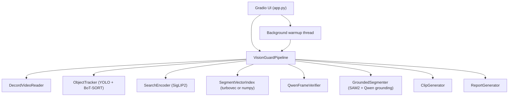

# Vision Guard: Audited Project Documentation

This document is a code-evidenced audit of the current repository at `D:\CDAC_PROJECT\CV_Project`.
It is written from the tracked source files and notebook in this repo only.
No architecture, feature, runtime path, or dependency is described unless it is directly visible in code or configuration.

## 1. Repository Scope

Vision Guard is a Python inference application with a Gradio UI.
It is designed for scan-first CCTV-style video search:

1. A video is scanned once.
2. Sampled frames are filtered, detected, embedded, and indexed.
3. A natural-language query is run against those indexes.
4. Top candidates are reselected, verified, optionally segmented, and exportable.

There is no training loop anywhere in this repository.
There is no database server.
There is no web backend framework other than the Gradio app process.

## 2. Tracked File Inventory

The tracked repository files are:

- `.gitignore`
- `PROJECT_DOCUMENTATION.md`
- `README.md`
- `VisionGuard_Colab.ipynb`
- `app.py`
- `assets/asset1.mp4`
- `assets/asset2.mp4`
- `assets/asset3.mp4`
- `assets/asset4.mp4`
- `assets/asset5.mp4`
- `assets/asset6.mp4`
- `cache_utils.py`
- `clip_generator.py`
- `optional_integrations/headroom/README.md`
- `optional_integrations/headroom/VISION_GUARD_CONTEXT.md`
- `pipeline.py`
- `qwen_verifier.py`
- `report_generator.py`
- `requirements.txt`
- `segmenter.py`
- `tracker.py`
- `vector_index.py`
- `video_reader.py`
- `vlm.py`

## 3. Untracked Local Runtime Artifacts Seen During Audit

These existed in the working tree during audit but are not tracked project source:

- `.venv`
- `.pycache_tmp`
- `.torch_cache`
- `.yolo`
- `output`
- `yolo11m.pt`

These are environment or runtime artifacts, not canonical source files.

## 4. Top-Level Architecture

The system has one central orchestrator: `VisionGuardPipeline` in `pipeline.py`.
Every other runtime module is either a helper, a model wrapper, or an export utility.

## 5. End-to-End Runtime Flow

### 5.1 Application startup

`app.py`:

- calls `setup_cache()`
- instantiates `pipe = VisionGuardPipeline()`
- starts `threading.Thread(target=pipe.warmup_models, daemon=True).start()`
- builds the Gradio UI
- wires `demo.load(fn=get_system_status, outputs=status)` so the status markdown reflects warmup state

### 5.2 Video scan flow

When the user clicks `step 1: scan video`, `scan_only(video)` calls `pipe.index_video_iter(video)`.

`index_video_iter()`:

1. creates a new output run directory
2. resets tracker state
3. opens the video via `DecordVideoReader`
4. samples frames at `sample_sec=0.75`
5. runs a cheap frame-difference filter
6. runs batched object detection on interesting frames
7. rejects non-content frames
8. writes kept frames to disk
9. embeds kept frames with SigLIP2
10. builds:
   - a frame-level vector index
   - a segment-level vector index
11. writes an `index.json` report
12. yields preview events during scan and one final `done` event

### 5.3 Query flow

When the user clicks `step 2: find matches`, `find_query(q)` drives either:

- `pipe.search_stream(q, top_k=4)` for streamed confirmed results
- or `pipe.search(q, top_k=4)` as a fallback path when streaming yields nothing in the loop body

Query handling inside the pipeline:

1. normalize the query
2. derive detector object classes and color terms if possible
3. reject event-style queries and unsupported simple exact-object labels
4. embed normalized query text with SigLIP2
5. try detector-first retrieval
6. if that fails, try frame-level ANN retrieval
7. if that fails, try object fallback matching from stored detection metadata
8. if that fails, try segment-level ANN retrieval
9. reselect best frame inside the clip window using denser 0.1s probing
10. verify top candidates with Qwen using exact-label and localization constraints
11. attach grounded or detector boxes for the first gallery image

### 5.4 Export flow

When the user selects clip rows and clicks export:

1. `app.py` calls `pipe.export_selected(picks, q)`
2. raw clips are created if missing
3. segmentation runs for each selected match
4. clip, JSON, CSV, HTML, ZIP outputs are written
5. Gradio file components are updated with those paths

## 6. File-by-File Technical Audit

### 6.1 `app.py`

Role: Gradio UI and top-level app process.

Direct dependencies:

- `os`
- `threading`
- `warnings`
- `pathlib.Path`
- `gradio`
- `cache_utils.setup_cache`
- `pipeline.VisionGuardPipeline`

Key responsibilities:

- environment-aware host selection
- optional public sharing through `GRADIO_SHARE`
- sample video discovery from `assets/*.mp4`
- UI rendering
- connecting UI actions to pipeline methods
- model warmup status display

Defined functions:

- `_in_colab() -> bool`
  - checks Colab/Kaggle-related environment variables and `/content/` path shape
- `_server_name() -> str`
  - uses `VISION_GUARD_HOST` override if present
  - else `0.0.0.0` for Colab/Kaggle
  - else `127.0.0.1`
- `_share_enabled() -> bool`
  - parses `GRADIO_SHARE`
- `_sample_videos() -> list[str]`
  - returns tracked sample MP4s if they exist
- `_meta(meta) -> str`
  - formats scan metadata markdown
- `_ans(q, rows) -> str`
  - formats top result summaries
- `_gallery(rows) -> list[tuple[path, caption]]`
  - builds gallery items from selected hit frame paths
- `scan_only(video)`
  - generator used by `scan_btn.click`
  - streams scan status and live preview image
- `_find_payload(status, q, seg)`
  - normalizes result payloads for the UI
- `find_query(q)`
  - generator used by `find_btn.click`
  - drives query search and status updates
- `export_selected(picks, q, hits)`
  - returns Gradio file visibility/value updates
- `get_system_status()`
  - returns `pipe.warmup_status()`

UI components:

- `video`: source video input
- `scan_btn`
- `status`: markdown used both for scan status and warmup status
- `live`: live indexing preview image
- `info`: scan metadata markdown
- `query`: natural-language query textbox
- `searched`: query expansion/status markdown
- `find_btn`
- `answer`
- `table`
- `pick`
- `export_btn`
- `zipf`, `html`, `csv`
- `gallery`
- `match_md`

Launch behavior:

- prints `http://127.0.0.1:7860` only when server binds localhost
- calls `demo.launch(server_name=server_name, share=share, show_error=True)`

### 6.2 `cache_utils.py`

Role: model-cache and Hugging Face token bootstrap, mainly for Colab.

Functions:

- `_setup_hf_token()`
  - checks `HF_TOKEN`, `HUGGINGFACE_TOKEN`, `HUGGINGFACEHUB_API_TOKEN`
  - mirrors the first available token back into both `HF_TOKEN` and `HUGGINGFACE_TOKEN`
  - attempts `huggingface_hub.login(token=token, add_to_git_credential=False)`
  - swallows any exception
- `setup_cache()`
  - early returns unless `/content/drive/MyDrive` exists
  - sets:
    - `HF_HOME`
    - `TRANSFORMERS_CACHE`
    - `HUGGINGFACE_HUB_CACHE`
    - `TORCH_HOME`
    - `YOLO_CONFIG_DIR`
    - `ULTRALYTICS_SETTINGS`
  - creates cache directories in Google Drive

Evidence-based conclusion:

- Drive-backed persistent caching is built into runtime code.
- Local non-Colab runs do not use Drive caching because the function returns early.

### 6.3 `clip_generator.py`

Role: raw clip extraction and browser-compatible MP4 finalization.

Direct dependencies:

- `os`
- `re`
- `shutil`
- `subprocess`
- `cv2`

Class: `ClipGenerator`

Methods:

- `__init__(out_dir)`
- `_safe(txt) -> str`
  - sanitizes clip filenames
- `clip_path(video, st, ed, name, pad=2.0) -> str`
  - computes deterministic clip path without writing the clip
- `extract_clip(video, st, ed, name, pad=2.0) -> str`
  - uses OpenCV `VideoCapture` and `VideoWriter`
  - writes `.part.mp4`
  - calls `_finalize_video`
- `_finalize_video(tmp, path)`
  - if `ffmpeg` exists, rewrites the temporary MP4 as H.264 `yuv420p` with `+faststart`
  - otherwise renames the temp file directly

Operational note:

- Clip extraction still uses OpenCV even though scan-time reading uses Decord.

### 6.4 `report_generator.py`

Role: report serialization and packaging.

Direct dependencies:

- `csv`
- `json`
- `os`
- `zipfile`
- `datetime`
- `jinja2.Template`

Class: `ReportGenerator`

Methods:

- `write_json(path, data) -> path`
- `write_csv(path, rows) -> path`
  - fields:
    - `rank`
    - `score`
    - `start`
    - `end`
    - `duration`
    - `summary`
    - `objects`
    - `tracks`
    - `clip`
- `write_html(path, data) -> path`
  - renders a Jinja2 HTML report titled `Vision Guard`
- `write_zip(path, files) -> path`
  - stores existing files only

### 6.5 `vector_index.py`

Role: ANN/search abstraction for frame and segment embeddings.

Direct dependencies:

- `os`
- `numpy`
- optional `turbovec.IdMapIndex`

Class: `SegmentVectorIndex`

Internal state:

- `bit_width`
- `idx`
- `ids`
- `vecs`
- `path`
- `backend`

Backends:

- `turbovec` when `IdMapIndex` loads successfully and build succeeds
- `numpy` fallback otherwise

Methods:

- `build(vectors, ids, path=None)`
- `build_merged(chunks, path=None)`
- `search(query, k)`

Persistence:

- if turbovec is active and `path` is provided, `.write(path)` is called
- the repo writes `.tvim` files into the run report directory

### 6.6 `video_reader.py`

Role: video frame access abstraction.

Direct dependencies:

- `cv2`
- `numpy`
- optional `decord`

Class: `DecordVideoReader`

Behavior:

- tries `decord.VideoReader(path, ctx=cpu(0))`
- falls back to `cv2.VideoCapture(path)` if Decord fails

Exposed interface:

- `__len__()`
- `get_frame(idx)`
- `get_batch(indices)`
- `ts_for(idx)`

Stored metadata:

- `fps`
- `count`
- `width`
- `height`
- `use_decord`

### 6.7 `tracker.py`

Role: object detection and tracking wrapper around Ultralytics YOLO.

Direct dependencies:

- `os`
- `shutil`
- `torch`
- `ultralytics.YOLO`

Initialization:

- sets `YOLO_CONFIG_DIR` to `<cwd>/.yolo` if not already defined
- ensures that directory exists

Class: `ObjectTracker`

Constructor signature:

- `model="yolo11m.pt"`
- `conf=0.22`
- `imgsz=640`
- `tracker="botsort.yaml"`
- `device=None`

Important implementation detail:

- `VisionGuardPipeline.__init__` also defaults to `yolo="yolo11m.pt"`, so the pipeline and tracker defaults are aligned.

Methods:

- `reset()`
- `_cached_model_path()`
  - prefers Drive-cached weights in `/content/drive/MyDrive/visionguard_cache/ultralytics/weights`
- `load()`
  - creates YOLO model
  - copies downloaded weight file into Drive cache when possible
- `class_ids(names)`
- `names()`
- `track(frame, cls=None)`
- `detect(frame, cls=None, conf=None)`
- `detect_batch(frames, cls=None, conf=None)`

Returned detection/tracking row format:

- `box`
- `conf`
- `cls`
- `name`
- plus `id` for tracking rows

### 6.8 `vlm.py`

Role: text and image embedding with SigLIP2.

Direct dependencies:

- `cv2`
- `numpy`
- `torch`
- `PIL.Image`
- `transformers.AutoModel`
- `transformers.AutoProcessor`

Class: `SearchEncoder`

Constructor defaults:

- `model="google/siglip2-so400m-patch14-384"`

State:

- `model_name`
- `dev`
- `image_batch_size`
- `p` processor
- `m` model
- `compiled`

Methods:

- `load()`
  - loads model and processor
  - places model on target device
  - calls `_maybe_compile()`
- `_maybe_compile()`
  - only attempts `torch.compile` on CUDA
  - compiles `self.m.vision_model` when present
- `_vec(x)`
  - extracts `pooler_output`, `image_embeds`, or `text_embeds`
- `_norm(x)`
  - converts the feature vector to unit-normalized `float32`
- `embed_text(txt) -> np.ndarray`
  - wraps the user text as `this is a photo of <query>`
- `embed_frame(frame) -> np.ndarray`
- `embed_frames(frames) -> list[np.ndarray]`

### 6.9 `qwen_verifier.py`

Role: query verification and phrase grounding using Qwen2.5-VL.

Direct dependencies:

- `json`
- `os`
- `re`
- `threading`
- `platform`
- `torch`
- `PIL.Image`
- optional `vllm`
- optional `qwen_vl_utils.process_vision_info`
- optional `transformers.AutoProcessor`
- optional `transformers.Qwen2_5_VLForConditionalGeneration`

Module-level state:

- `_DEV_MODE = platform.system() == "Windows" and not torch.cuda.is_available()`

This is a deliberate Windows CPU local-development bypass.

Class: `QwenFrameVerifier`

Class-level attribute:

- `_ABSTRACT_TERMS`
  - used to lower confidence threshold for abstract/event-style queries

Constructor default model:

- `Qwen/Qwen2.5-VL-7B-Instruct-AWQ`

Backends:

- `vllm`
- `hf`
- `dev_passthrough`
- `none`

Methods:

- `_confidence_threshold(query) -> float`
  - returns `0.30` for abstract terms
  - returns `0.45` otherwise
- `load()`
  - enters `dev_passthrough` immediately on Windows CPU
  - else tries vLLM
  - else tries Transformers
- `_load_vllm()`
- `_load_hf()`
- `_extract_json(text)`
- `_clean_boxes(boxes, size)`
- `_ask(frame_path, prompt, max_new_tokens=180)`
- `_ask_vllm(frame_path, prompt, max_new_tokens=180)`
- `warmup()`
- `_cache_key(frame_path, query, frame_key=None)`
- `verify_query(frame_path, query, frame_key=None)`
- `ground_phrase(frame_path, phrase, multi=True, frame_key=None)`

`verify_query()` return shape:

- `matched: bool`
- `confidence: float`
- `caption: str`
- `boxes: list`

Important current behavior:

- In `dev_passthrough` mode it returns:
  - `matched=True`
  - `confidence=0.55`
  - a fixed caption
  - `boxes=[]`
- That means local Windows CPU verification is intentionally non-faithful and should not be treated as a true quality signal.

### 6.10 `segmenter.py`

Role: grounding-to-box fallback and SAM2 segmentation overlay.

Direct dependencies:

- `os`
- `shutil`
- `subprocess`
- `cv2`
- `numpy`
- `torch`
- `PIL.Image`
- `qwen_verifier.QwenFrameVerifier`
- `transformers.Sam2Model`
- `transformers.Sam2Processor`

Class: `GroundedSegmenter`

Constructor defaults:

- `sam="facebook/sam2.1-hiera-small"`
- `verifier_model="Qwen/Qwen2.5-VL-7B-Instruct-AWQ"`

Methods:

- `load()`
- `detect(frame_path, query, fallback_boxes=None)`
  - asks Qwen for boxes
  - falls back to supplied boxes if Qwen returns none
  - fabricates score values by rank position
- `segment(frame, boxes)`
- `overlay(frame, boxes, scores, masks)`
- `segment_clip(video, query, out_path, frame_dir, stride=3, fallback_boxes=None)`
  - samples every third frame of the raw clip
  - writes segmented preview frames when boxes exist
  - writes a fallback frame if no matches are ever seen
- `_finalize_video(tmp, out_path)`

Important implementation note:

- Qwen is the only grounding source.
- There is no Grounding DINO or Florence grounding path in current code.

### 6.11 `pipeline.py`

Role: the full scan, retrieval, verification, reselection, segmentation, and export orchestrator.

Direct dependencies:

- `os`
- `re`
- `shutil`
- `time`
- `concurrent.futures.ThreadPoolExecutor`
- `datetime`
- `cv2`
- `numpy`
- all runtime helper modules

Class: `VisionGuardPipeline`

#### Constructor and state

Constructor signature:

- `out_dir="output"`
- `yolo="yolo11m.pt"`
- `clip_model="google/siglip2-so400m-patch14-384"`
- `verifier_model="Qwen/Qwen2.5-VL-7B-Instruct-AWQ"`
- `sam="facebook/sam2.1-hiera-small"`

State created in `__init__`:

- `self.trk`
- `self.enc`
- `self.vlm`
- `self.ver`
- `self.seg`
- `self.idx`
- `self.run_dir`
- `self.clip`
- `self.rep`
- `self.last_hits`
- `self.search_idx`
- `self.frame_idx`
- `self.pool`
- `self.raw_jobs`
- `self.seg_jobs`
- `self._warmup_failures`
- `self._warmup_done`

#### Query parsing and appearance helpers

Methods:

- `_color_words()`
- `_query_colors(q)`
- `_estimate_color(frame, box)`
- `_appearance_tags(frame, detections)`
- `_q_objs(q)`
- `_is_event_query(q)`
- `_normalize_query(q)`
- `_query_detector_classes(q)`
- `_is_strict_object_query(q)`
- `_is_simple_unsupported_object_query(q)`
- `_matching_detections(row, qobjs, qcolors, cls_to_name=None)`
- `_query_variants(q)`
- `_embed_query(q)`

These methods implement:

- singular/plural normalization
- limited synonym mapping
- explicit color extraction for vehicles
- object-class extraction for supported detector labels
- event-query rejection
- rejection of unsupported simple exact-object labels
- minimal query variant generation using original and normalized forms

#### Scan-time helpers

Methods:

- `_clip_name(i, kind)`
- `_iou(a, b)`
- `_new_run(video)`
- `_cos(a, b)`
- `_preview(frame, tracks, ts)`
- `_is_non_content_frame(frame, tracks)`
- `_cheap_signature(frame, size=(64, 36))`
- `_frame_diff_score(sig_a, sig_b)`
- `_is_interesting_frame(frame, prev_sig, ts, last_keep_ts, min_motion=0.025, force_keep_gap=4.0)`

These implement:

- run-directory initialization
- preview rendering
- non-content frame rejection
- cheap motion / duplicate filtering

#### Detector-first retrieval path

Methods:

- `_refine_detector_hits(q, top_k)`
- `_draw_boxes(src_path, boxes, out_name, label_text=None)`
- `_attach_gallery_frame(row, query)`

Behavior:

- scans stored frame detections
- scores direct detector matches
- applies color filtering when query contains color terms
- forms clip windows around peak timestamps
- can draw either Qwen boxes or detector boxes onto the gallery frame

#### Dense reselection and verification

Methods:

- `_frame_summary(q, peak_ts, objs)`
- `_clip_bounds(ts, pad=None)`
- `_reselect_best_frame(video_path, start_sec, end_sec, query_vec, step_sec=0.1)`
- `_refresh_det_boxes_for_hit(hit, query)`
- `_apply_reselection(hits, query, query_vec, top_n=1)`
- `_verify_rows(rows, query, top_n=1)`
- `_verify_rows_stream(rows, query, top_n=1)`
- `_confirmed_rows(rows)`
- `_cluster_frame_hits(rows, top_k, gap_sec)`
- `_fallback_object_hits(q, top_k)`

Key behavior:

- dense reselection probes frames every `0.1s` inside a candidate clip window
- verification can:
  - promote scores for confirmed matches
  - demote low-confidence/unverified rows
  - attach boxes from verifier output
- low-confidence rows are retained in `_verify_rows`, but `search_stream()` only emits confirmed matches

#### Index build logic

Method:

- `index_video_iter(video, sample_sec=0.75, win_sec=4.5)`

Current scan algorithm:

1. `self._new_run(video)`
2. `self.trk.reset()`
3. `vr = DecordVideoReader(video)`
4. compute `fps`, `total`, `dur`, `step`
5. generate `sample_indices = range(0, total, step)`
6. batch-read sampled frames
7. filter by `_is_interesting_frame`
8. detect objects in batch with `self.trk.detect_batch(..., conf=0.18)`
9. reject frames classified by `_is_non_content_frame`
10. build per-frame metadata:
    - `objects`
    - `tracks`
    - `appearances`
    - `detections`
    - `motion_score`
    - `keep_reason`
    - `object_delta`
    - `still_people`
    - `person`
11. write JPEG frame files into `run_dir/frames`
12. embed pending frames via `self.enc.embed_frames`
13. create frame rows and frame embedding chunks
14. construct segment rows from fixed sample blocks:
    - `seg_id`
    - `start`
    - `end`
    - `mid`
    - `emb`
    - `frame_path`
    - `objects`
    - `tracks`
    - `temporal_stats`
    - `tags`
15. populate `self.idx`
16. build and persist:
    - `frame_index.tvim`
    - `segment_index.tvim`
17. write `reports/index.json`
18. yield one final `done` payload

`self.idx` structure after scan:

- `video`
- `meta`
- `frames`
- `segments`

`meta` currently includes:

- `video`
- `fps`
- `frames`
- `duration`
- `sample_sec`
- `win_sec`
- `segments`

The final yielded `done` payload adds:

- `retriever`
- `segment_retriever`
- `verifier`

#### Warmup

Methods:

- `warmup_models()`
- `warmup_status()`

Behavior:

- warms:
  - tracker
  - encoder
  - verifier
- records exceptions in `_warmup_failures`
- marks `_warmup_done`
- exposes status strings:
  - `Models loading...`
  - `All models ready.`
  - `WARNING: ...`

#### Search orchestration

Methods:

- `_candidate_hits(raw_q, top_k=4)`
- `search_stream(raw_q, top_k=4)`
- `search(q, top_k=4)`
- `prepare_hits(hits, query)`

Search order in `_candidate_hits()`:

1. detector-first hits
2. frame ANN hits
3. object fallback hits
4. low-confidence clustered frame hits for non-strict queries only
5. segment ANN hits

Important behavior:

- event-style queries return no matches
- unsupported simple exact-object labels return no exact matches instead of semantic substitutions
- strong detector and object-fallback hits can still be surfaced for supported object queries even when verifier confirmation is absent

#### Clip generation and segmentation jobs

Methods:

- `_build_raw_clip(row)`
- `_ensure_raw_clip(row, wait=True)`
- `_segment_payload(row, query)`
- `_start_segment(row, query)`
- `_ensure_segment(row, query)`
- `export_selected(picks, query)`

Concurrency model:

- `ThreadPoolExecutor(max_workers=2)`
- `raw_jobs` keyed by `match_id`
- `seg_jobs` keyed by `match_id`

Export outputs:

- selected JSON
- selected CSV
- selected HTML
- selected ZIP
- segmented clip or raw clip per match

### 6.12 `README.md`

Role: concise user-facing entrypoint.

Current contents:

- points to `PROJECT_DOCUMENTATION.md`
- points to `optional_integrations/headroom/README.md`
- provides quick start
- describes current stack
- gives Colab run outline

README now matches the current detector default used by the pipeline.

### 6.13 `VisionGuard_Colab.ipynb`

Role: Colab execution path from GitHub.

Notebook flow:

1. clone repo into `visionguard-ai`
2. `%cd visionguard-ai`
3. `git pull`
4. mount Drive
5. optionally load `HF_TOKEN` from Colab secrets
6. set persistent cache environment variables under `/content/drive/MyDrive/visionguard_cache`
7. upgrade `pip`
8. install `requirements.txt`
9. optionally check GPU
10. set:
    - `VISION_GUARD_HOST=0.0.0.0`
    - `GRADIO_SHARE=1`
11. run `python -u app.py`
12. use the printed `gradio.live` URL

Evidence-based conclusion:

- The notebook is designed around `gradio.live`, not iframe serving or FastAPI.

### 6.14 `optional_integrations/headroom/README.md`

Role: documentation-only placeholder for a non-runtime optional integration.

Code-evidenced status:

- this folder is not imported by the app runtime
- it documents possible future compression use cases
- it explicitly states that it is removable without changing the main runtime

### 6.15 `.gitignore`

Current ignore entries:

- `__pycache__/`
- `.pycache_tmp/`
- `.yolo/`
- `output/`
- `yolo11n.pt`
- `yolo11m.pt`
- `.venv`

Operational implication:

- model weights and outputs are intentionally excluded from git

## 7. Data Contracts

### 7.1 Frame row in `self.idx["frames"]`

Created in `index_video_iter()` as:

- `frame_id: int`
- `frame: int` (source frame index)
- `ts: float`
- `frame_path: str`
- `representative_frame_path: str`
- `objects: list[str]`
- `appearances: list[str]`
- `tracks: list`
- `detections: list[dict]`
- `motion_score: float`
- `keep_reason: str`
- `still_people: int`
- `object_delta: int`

### 7.2 Segment row in `self.idx["segments"]`

- `seg_id: np.uint64`
- `start: float`
- `end: float`
- `mid: float`
- `emb: np.ndarray`
- `frame_path: str`
- `objects: list[str]`
- `tracks: list`
- `temporal_stats: dict`
- `tags: list`

### 7.3 Candidate / hit row after search preparation

Depending on path, rows may contain:

- `query`
- `score`
- `base_score`
- `cache_key`
- `start`
- `end`
- `peak_ts`
- `representative_frame_path`
- `frame_path`
- `objects`
- `tracks`
- `appearances`
- `matched_detections`
- `det_boxes`
- `tags`
- `summary`
- `verified_caption`
- `verified_match`
- `verify_score`
- `grounded`
- `low_confidence`
- `gallery_frame`
- `raw_clip`
- `clip`
- `frames`
- `segmented`
- `label`

## 8. Query Semantics and Reasoning Layers

This project does not use a separate NLP model.
Natural-language handling is distributed across:

- `pipeline.py` query normalization and variant expansion
- `vlm.py` SigLIP2 text embeddings
- `qwen_verifier.py` Qwen visual verification and grounding

Concrete reasoning layers:

1. lexical normalization:
   - plurals
   - a small synonym table for supported detector classes
2. semantic embedding search:
   - SigLIP2 text-to-frame/segment similarity
3. detector metadata matching:
   - class names and color heuristics
4. verification:
   - Qwen confirms or rejects visible evidence
5. segmentation:
   - SAM2 masks boxes provided by Qwen or detector fallback

## 9. Technology Stack With Rationale From Code

### 9.1 Gradio

Used because the project is implemented as a single-process interactive UI in `app.py`.
Evidence:

- `import gradio as gr`
- direct `Blocks`, `Video`, `Button`, `Markdown`, `Gallery`, `File`, `Examples`

### 9.2 Decord

Used for batch/random-access video reading in `video_reader.py`.
Rationale from code:

- `get_batch()` is used during scan
- `get_frame()` and `ts_for()` support reselection and metadata
- OpenCV is kept only as a fallback

### 9.3 Ultralytics YOLO + BoT-SORT

Used in `tracker.py` for object detection and tracking.
Rationale from code:

- detector class IDs are used for detector-first retrieval
- detection metadata is reused during search and export
- tracker state can persist across frames if `track()` is used

### 9.4 SigLIP2

Used in `vlm.py` for image and text embeddings.
Rationale from code:

- frame embeddings are indexed
- segment embeddings are indexed
- query text is embedded through multiple query variants
- dense reselection rescoring also uses SigLIP2 frame embeddings

### 9.5 turbovec

Used opportunistically in `vector_index.py`.
Rationale from code:

- provides `IdMapIndex`
- persists ANN indexes to disk
- falls back to pure NumPy if unavailable or failing

### 9.6 Qwen2.5-VL-7B-Instruct-AWQ

Used in `qwen_verifier.py`.
Rationale from code:

- verifies whether a frame actually satisfies the exact user query
- returns bounding boxes for visible matching regions
- can run through vLLM on CUDA
- can run through Transformers if vLLM is unavailable
- is bypassed on Windows CPU dev mode

### 9.7 SAM2.1 Hiera Small

Used in `segmenter.py`.
Rationale from code:

- segments boxes into masks
- overlays masks into preview/export frames
- used only during segmentation/export, not during the initial scan

### 9.8 OpenCV

Used for:

- frame color analysis
- frame drawing
- JPEG writing
- clip extraction
- fallback video reading

### 9.9 Jinja2

Used only for HTML report generation in `report_generator.py`.

### 9.10 ThreadPoolExecutor

Used in `pipeline.py` to allow background raw-clip and segmentation jobs.

## 10. Environment Variables and Their Effects

From code and notebook:

- `HF_TOKEN`
  - Hugging Face authentication
- `HUGGINGFACE_TOKEN`
  - alternate token source
- `HUGGINGFACEHUB_API_TOKEN`
  - alternate token source
- `HF_HOME`
- `TRANSFORMERS_CACHE`
- `HUGGINGFACE_HUB_CACHE`
- `TORCH_HOME`
- `YOLO_CONFIG_DIR`
- `ULTRALYTICS_SETTINGS`
- `VISION_GUARD_HOST`
  - host override for Gradio binding
- `GRADIO_SHARE`
  - toggles `share=True`
- `COLAB_RELEASE_TAG`
- `COLAB_BACKEND_VERSION`
- `COLAB_GPU`
- `JPY_PARENT_PID`
- `KAGGLE_KERNEL_RUN_TYPE`

## 11. Output Layout

Each scan creates a timestamped run directory under `output/`:

- `frames/`
  - sampled frame JPEGs
  - reselection frames
  - gallery frames with boxes
- `clips/`
  - raw clips
  - segmented clips
- `reports/`
  - `index.json`
  - `frame_index.tvim`
  - `segment_index.tvim`
  - selected JSON/CSV/HTML/ZIP exports
- `segments/`
  - per-match segmentation source frames and saved segmented stills

## 12. Current Operational Edge Cases and Code-Level Caveats

This section is limited to issues directly visible in source.

### 12.1 Windows CPU verifier bypass

Code evidence:

- `_DEV_MODE = platform.system() == "Windows" and not torch.cuda.is_available()`
- `load()` sets `backend = "dev_passthrough"`
- `verify_query()` returns a fixed positive result in that mode

Effect:

- local Windows CPU runs are not an accuracy-faithful verifier environment

### 12.2 `search_stream()` emits only confirmed rows

Code evidence:

- it yields from `_verify_rows_stream()`
- it only emits when `row.get("verified_match")`
- if nothing is emitted, it yields `[]`

Effect:

- low-confidence semantic candidates produced by `_candidate_hits()` are not surfaced through the streaming path unless they become confirmed
- trusted detector and object-fallback hits are still surfaced for supported object queries even when verifier confirmation is absent

### 12.3 Unsupported simple exact-object labels return no matches

Code evidence:

- `_is_simple_unsupported_object_query()` returns early before semantic candidate retrieval
- `_candidate_hits()` uses that early return

Effect:

- queries such as `taxi` do not fall through to loose car-like visual matches

### 12.4 Event-style queries are intentionally disabled

Code evidence:

- `_is_event_query()` returns early before retrieval

Effect:

- terms such as collision, fight, fall, crowd, and loitering are currently out of scope for search results

### 12.5 Segmentation is export-time, not scan-time

Effect:

- the scan preview shows detection boxes, not SAM masks
- segmentation cost is deferred to selected matches

## 13. What This Project Does Not Contain

Not present in tracked code:

- a training loop
- a fine-tuning pipeline
- a vector database server
- a REST backend
- a FastAPI app
- LangChain
- LlamaIndex
- Grounding DINO
- Florence-2
- a relational database
- persistent query history storage

## 14. Why the Current Design Exists

The repo’s design shows a clear optimization goal:

- keep scan-time logic in one pipeline
- cache and persist model downloads in Colab
- perform expensive reasoning only after ANN narrowing
- keep the UI minimal and single-process
- export reports from in-memory hit objects rather than a separate storage layer

The practical design split is:

- cheap preprocessing and detection first
- embedding retrieval second
- dense frame reselection third
- Qwen verification fourth
- segmentation only for selected outputs

## 15. Suggested Reading Order for New Engineers

1. `app.py`
2. `pipeline.py`
3. `tracker.py`
4. `vlm.py`
5. `qwen_verifier.py`
6. `segmenter.py`
7. `video_reader.py`
8. `clip_generator.py`
9. `report_generator.py`
10. `vector_index.py`
11. `VisionGuard_Colab.ipynb`
12. `optional_integrations/headroom/README.md`

## 16. Rigorous Technical Interview Questions for This Project

### Architecture

1. Why is the system scan-first instead of query-first?
2. Why are there separate frame and segment indexes?
3. Why is verification deferred until after candidate retrieval?
4. Why is segmentation not part of the scan path?
5. What is the role of `ThreadPoolExecutor` in this design?

### Retrieval and ranking

6. Why does the query use `_query_variants()` instead of one plain embedding?
7. What are the tradeoffs of embedding `this is a photo of <query>` for text?
8. Why does the system mix detector-first retrieval with embedding search?
9. What failure cases are addressed by `_apply_reselection()`?
10. Why does `_candidate_hits()` search frames before segments?

### Detection and visual semantics

11. How are color-specific queries such as `yellow car` handled?
12. What are the risks of the HSV-based vehicle color heuristic?
13. Why might a strict object query still fail even when the object is present?
14. Why does the system return no match for an unsupported label like `taxi` instead of a similar object such as `car`?
15. How would you explain the difference between `detections`, `objects`, and `appearances` in the stored metadata?

### Model-serving behavior

16. Under what conditions does Qwen run through vLLM versus Transformers?
17. What is the practical effect of `dev_passthrough` on Windows CPU?
18. Why is `torch.compile` used only on the SigLIP vision tower and only on CUDA?
19. What does the code gain from AWQ quantization if the model path itself is already a quantized checkpoint?
20. What are the implications of using `device_map="auto"` in the verifier and segmenter loaders?

### Performance

21. What parts of scan time are reduced by Decord?
22. What parts of scan time are still dominated by heavy models?
23. Why is `_is_interesting_frame()` a useful prefilter?
24. What is the tradeoff of `sample_sec=0.75`?
25. Why does dense reselection probe at `0.1s` rather than scanning every frame?

### Reliability and correctness

26. What does `warmup_status()` protect against compared with the previous silent warmup path?
27. Why is `search_stream()` behavior important to understand when debugging "no results" issues?
28. What does the system currently do when Qwen returns no boxes for segmentation?
29. Why does the current pipeline reject unsupported simple exact-object labels early?

### Export and UX

30. Why does the gallery box rendering target only the first prepared hit by default?
31. Why are raw clips and segmented clips both preserved?
32. What makes the exported HTML report deterministic versus runtime-variable?
33. Why does the ZIP contain clips but not every generated still frame?
34. How would you explain to a reviewer why the UI uses one status component for both warmup and scan feedback?

### Deployment and operations

35. Why does `setup_cache()` early-return outside Google Drive?
36. Why is `GRADIO_SHARE=1` the expected Colab execution path in the notebook?
37. What happens if `HF_TOKEN` is missing?
38. Why are YOLO weights copied into Drive cache after download?
39. If you needed reproducible deployment behavior, what code paths in this repo would you audit first?

## 17. Short Summary

Vision Guard is a single-process Gradio application built around one orchestration class, `VisionGuardPipeline`.
It uses:

- Decord/OpenCV for video access
- YOLO for scan-time object detection
- SigLIP2 for text-image retrieval
- turbovec or NumPy for ANN lookup
- Qwen2.5-VL for post-retrieval visual verification and grounding
- SAM2 for export-time segmentation
- OpenCV/ffmpeg for clip generation
- Jinja2/CSV/JSON/ZIP for reports

The design is scan first, retrieval second, verification third, segmentation last.
That design choice is directly reflected in the current codebase.
