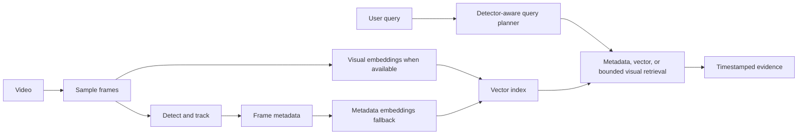

# Architecture

VisionGuard has one operational application and one indexing path. The Flask server accepts a bundled or local video, the pipeline samples frames, YOLO detects and tracks runtime classes, and the encoder stores visual or metadata vectors with timestamps and detection details. Search plans are built from the user query plus the active detector's labels; there is no application object whitelist.

The preferred retrieval path uses SigLIP embeddings. When that model is unavailable, the fallback index is still meaningful: it encodes detected classes, colors, appearances, and motion rather than zero vectors. Exact detector-label queries remain local. Open descriptions can use bounded NVIDIA frame verification when configured; otherwise the response reports that the capability is unavailable instead of inventing a match.

Looking Glass informed the decision to keep ingestion, model services, and search responsibilities distinct. Its source was not copied because the inspected repository did not contain a license file, and its heavier Qdrant, React, Ollama, and multi-model stack would add unnecessary operational dependencies here.
