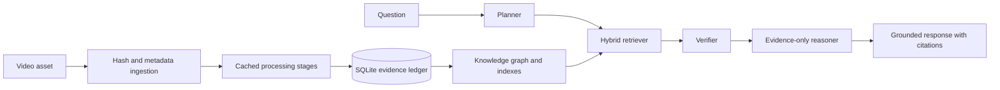

# VisionGuard 2 architecture

VisionGuard 2 treats persisted, provenance-bearing evidence as the only factual input to question answering. Models propose observations; deterministic contracts record their source, confidence, time interval, frame, object, track, and event identifiers. Retrieval ranks observations, verification may reject them, and reasoning receives accepted evidence only.

The processing boundary is adapter-based. YOLO or GroundingDINO supply detections, BoTSORT supplies tracks, SAM2 supplies masks, Whisper and acoustic models supply timed audio observations, VLMs supply captions or attribute proposals, and deterministic rules combine tracks into temporal events. If an adapter is unavailable, that stage produces no facts.

SQLite is the current durable implementation. Its narrow repository contract allows DuckDB, PostgreSQL, FAISS, or NetworkX-backed implementations without changing agents. Conversation history is never stored in the evidence ledger and may resolve references only to existing entity IDs.

The in-process queue is a development implementation. Production should use a durable queue and idempotent stage manifests keyed by video SHA-256, model version, and configuration digest.
