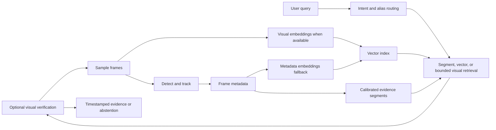

# Architecture

VisionGuard has one operational application and one evidence path. Upload registers an immutable video and its decoder metadata. A separate index action samples and deduplicates frames, detects and tracks runtime classes, groups calibrated evidence into temporal segments, and stores vectors plus source metadata. Search plans use active detector labels and a small documented alias layer; aliases only resolve classes the active detector actually supports.

The code follows four local boundaries: `web_app` owns HTTP/job state, `video_pipeline` owns decode/index/query orchestration, `model_services` owns model adapters, and `search` owns deterministic language routing. `runtime/settings.py` validates pipeline configuration once per pipeline instance. `video_pipeline/detector_evidence.py` owns detector-observation calibration and temporal grouping; it does not load models or write files.

Each result must retain a source-frame path, peak timestamp, evidence interval, retrieval route, and verification state. Retrieval proposes candidates; optional visual verification changes their state but never fabricates source evidence.

The preferred semantic path uses locally cached SigLIP embeddings. When that model is unavailable, the local index remains meaningful because it encodes detected classes, colors, appearances, and motion rather than zero vectors. Exact detector-label and documented-alias queries remain local. Open descriptions can use bounded visual verification only when explicitly configured; otherwise the response abstains rather than inventing a match.

Text reasoning is selected through `MODEL_PROVIDER` and supports `llama_cpp`, `nvidia`, `groq`, and `none`. llama.cpp is the local-first default. Provider health and query-intent normalization are isolated from ingestion, so an unavailable text or vision endpoint cannot prevent video storage, metadata probing, frame extraction, detection, or deterministic timestamps. Open visual claims still require semantic or vision evidence; a text model alone cannot promote an unsupported event to a result.

Looking Glass informed the decision to keep ingestion, model services, and search responsibilities distinct. Its source was not copied because the inspected repository did not contain a license file, and its heavier Qdrant, React, Ollama, and multi-model stack would add unnecessary operational dependencies here.
