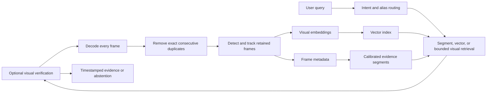

# Architecture

VisionGuard has one operational application and one evidence path. Upload registers an immutable video and its decoder metadata. A separate index action decodes every frame in order, removes only exact consecutive pixel duplicates, detects and tracks every retained frame, groups evidence into temporal segments, and stores vectors plus source metadata. Search plans use active detector labels and a small documented alias layer; aliases only resolve classes the active detector actually supports.

The code follows five boundaries: `web_app` owns HTTP/job state, `video_pipeline` owns decode/index persistence, `model_services` owns detector and embedding adapters, `semantic` owns required NVIDIA enrichment and track event extraction, and `search` owns LangGraph query orchestration. `runtime/settings.py` validates pipeline configuration once per pipeline instance.

Each result retains a source-frame path, peak timestamp, evidence interval, retrieval route, evidence state, and claim provenance. Video-scoped snapshots keep frame ledgers and vector indexes together. Explicit verification can change state but never create source evidence.

The CPU-first indexer retains every decoded frame whose pixels differ from the immediately preceding frame. Temporal groups use source timestamps, not retained-frame counts. Exact object queries remain detector-local; scene descriptions use the stored segment vector index and remain explicitly unverified unless the user requests and passes verification.

`SEMANTIC_PROVIDER=nvidia` is required and live-authenticated before indexing. Every segment must receive validated NVIDIA JSON or the job fails. `MODEL_PROVIDER` controls optional reasoning/verification and never replaces semantic analysis. LangGraph uses detector, count, numeric temporal, event, zone, vector-scene, and explicit-verification routes; unsupported capabilities abstain.

Looking Glass informed the decision to keep ingestion, model services, and search responsibilities distinct. Its source was not copied because the inspected repository did not contain a license file, and its heavier Qdrant, React, Ollama, and multi-model stack would add unnecessary operational dependencies here.
