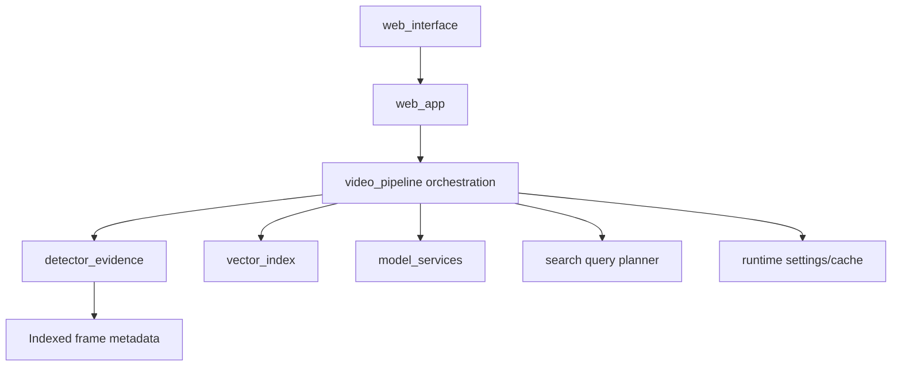

# Architecture Review

## Current state

VisionGuard is a local-first, evidence-grounded video retrieval system. The operational path is upload, explicit index, decode every frame, exact consecutive deduplication, detection/tracking, metadata and embedding construction, segment indexing, query planning, retrieval, optional verification, and timestamped export. The web application does not begin indexing during upload.

## Refactor applied

`visionguard/video_pipeline/detector_evidence.py` now owns calibrated detector retrieval and temporal evidence grouping. `VisionGuardPipeline` delegates to it while retaining its public methods for the web application and tests. `visionguard/runtime/settings.py` centralizes validated settings used by scan and retrieval policy. `visionguard/runtime/logging.py` provides one idempotent application logging configuration; scan progress is logged as structured key/value data rather than printed ad hoc.

No public endpoint, persisted evidence schema, or query response contract was renamed. No source file was deleted solely on an assumption of being unused.

## Dependency direction

The intended direction is inward: HTTP/UI code calls orchestration; orchestration calls deterministic retrieval and adapters; model adapters do not import web routes. `detector_evidence` is deliberately model-free so it can be unit-tested with indexed observations.

## Repository hygiene

Tracked source remains code, configuration templates, docs, tests, evaluation schemas, and essential sample videos. Generated model weights, cache directories, frame dumps, thumbnails, indexes, reports, logs, exports, and virtual environments are ignored. The removed `evaluation/latest_asset_report.json` was a generated report, not a source fixture. Existing `.pytest_cache` could not be removed because Windows denied access; it is ignored and has no runtime role.

## Remaining risks before production

The pipeline class still contains ingestion, query state, verification coordination, and export methods, so a later extraction should split these behind the existing interface. Retrieval accuracy cannot be claimed until human-reviewed labels exist. Non-loopback mutations now require a configured bearer token and bounded resources, but durable multi-user authorization, persistent jobs, malware scanning, and distributed quotas remain production work.

## Validation standard

The regression suite must pass with generated pytest caches disabled. The end-to-end verifier should run against a locally bootstrapped model and sample video before any release; it validates system behavior, not a statistically valid accuracy claim.
