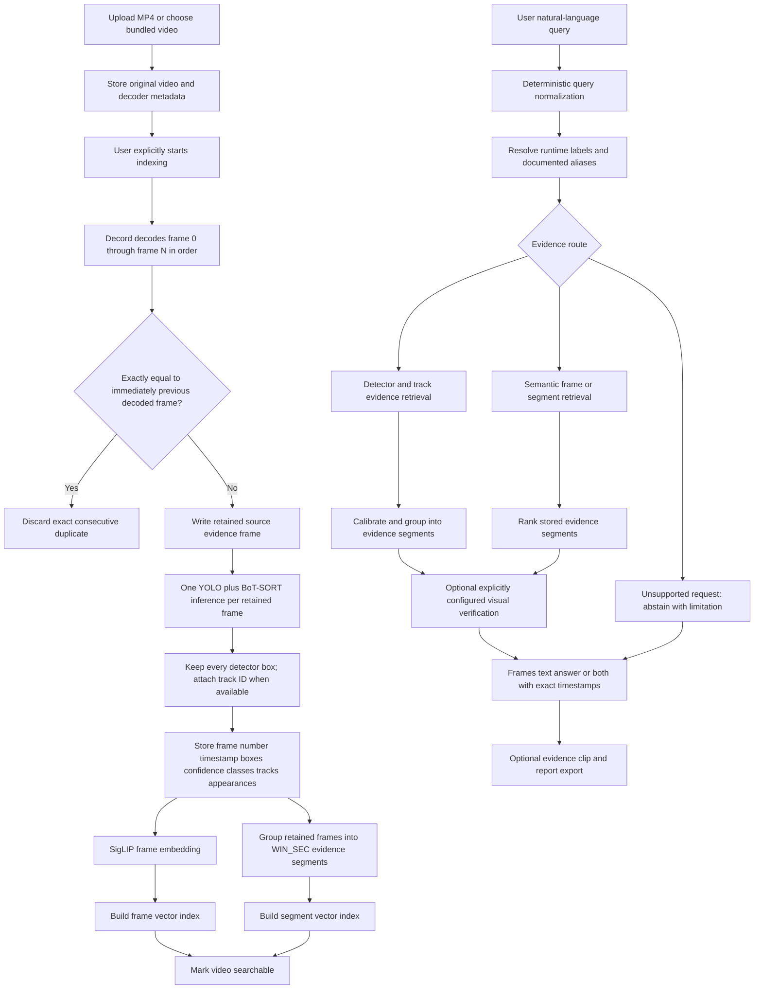

# VisionGuard Project Flow

> **Maintenance rule:** This is the canonical operational-flow document. Any change to video ingestion, indexing, deduplication, retrieval, verification, or evidence export must update this file in the same pull request.

## Exact flow

1. The user uploads an MP4 or selects a bundled video. Upload stores the original file and decoder metadata only; it does not start indexing.
2. The user explicitly starts indexing. The pipeline opens the video with Decord and reads every source frame in ascending frame-number order.
3. Each decoded frame is compared with the immediately preceding decoded frame. It is removed only if its shape, data type, and every pixel are identical. There is no time-based sampling, motion threshold, forced keyframe interval, empty-frame removal, or decoder fallback.
4. Every retained frame is submitted for source-evidence writing and processed once by YOLO with BoT-SORT tracking. That single inference returns every detector box and adds a track ID where available; no second YOLO detection pass is run.
5. Evidence-frame writes run concurrently with subsequent CPU work and are checked before their embedding batch is committed. SigLIP embeds every retained frame. Retained frames are grouped into `WIN_SEC` evidence segments for segment-level retrieval; this grouping does not remove frames.
6. Frame vectors, segment vectors, metadata, and source-frame paths are written into the local evidence index. The video becomes searchable only after this completes.
7. A user query is normalized by the deterministic query planner. Runtime detector labels and documented aliases determine whether the query uses detector evidence, track-event evidence, semantic evidence, or a clearly marked unsupported/abstaining path.
8. Retrieval returns evidence segments with a representative stored frame, peak timestamp, start/end timestamps, source classes, and retrieval mode. Detector results are calibrated and grouped into temporal segments rather than presented as isolated frame claims.
9. Optional visual verification can evaluate retrieval candidates only when explicitly configured. It may confirm or reject a candidate, but cannot create evidence or turn an unsupported request into a confirmed result.
10. The UI/API returns either evidence frames, a timestamped textual answer, or both. Exported clips and reports remain traceable to the stored source evidence.

## Non-negotiable indexing invariants

- Every source frame is decoded in order.
- Only exact consecutive pixel duplicates are discarded.
- Every retained frame has a source frame number and decoder-derived timestamp.
- Every retained frame has one YOLO inference; untracked detector boxes are retained instead of triggering a second detection pass.
- No retrieved result is presented as visually verified unless an explicitly configured verifier confirms it.
- `WIN_SEC` affects segment aggregation only; it never changes which frames are extracted or indexed.
