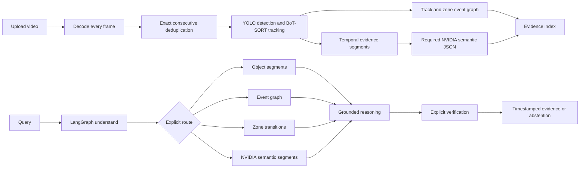

# Semantic evidence architecture

The semantic index has one required provider: NVIDIA multimodal inference. Provider readiness is authenticated, and every source-time-bounded segment stores structured output as an unverified semantic description with its source frame and detector context. NVIDIA text never overrides detector or event facts. Invalid or unavailable responses fail the index job.

The event graph is independent of NVIDIA descriptions. It consumes retained frames, track IDs, boxes, and configured normalized regions. It produces first-observed state, measured movement, observed dwell, and zone transitions with exact source evidence. It does not treat last observation as disappearance or first observation as physical entry.

The LangGraph query path is `understand -> retrieve -> reason -> verify -> respond`. Retrieval uses detector segments for objects, distinct tracks for counts, timestamp filters for numeric temporal requests, the event graph for implemented events, configured zones, and the stored segment vector index for scene requests. Verification runs only for an explicit request; a non-confirmed result abstains.

